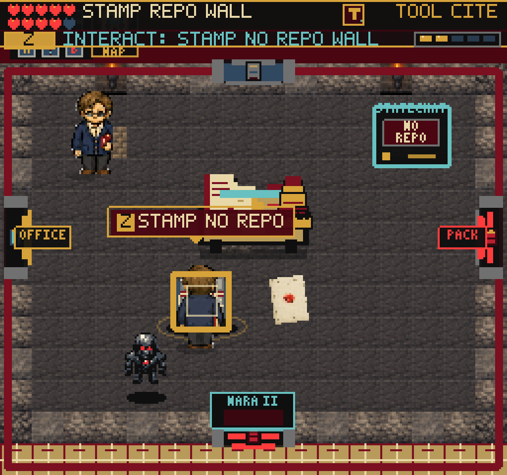
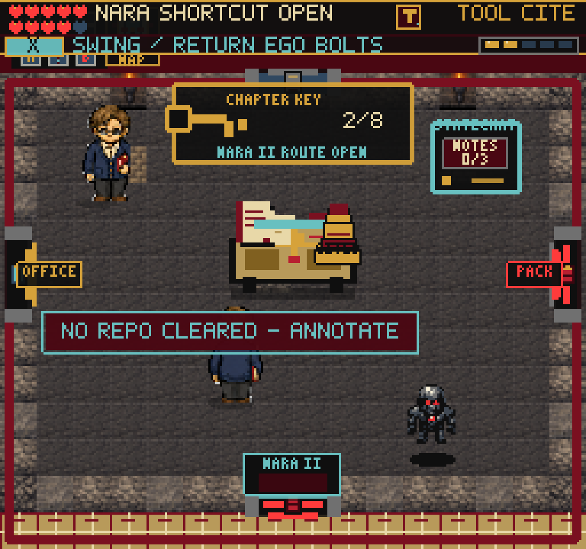
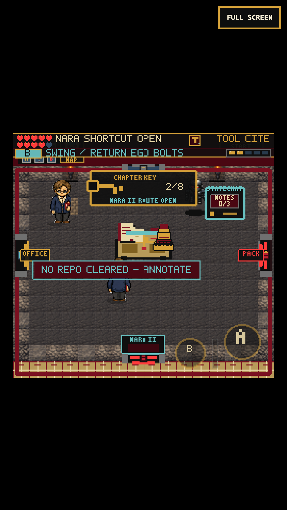

# Archive Citation Stamp wall

## Problem and fix

The Guide teaches X / touch B as the equipped-tool swing. Archive A1's source
workflow returned before ordinary wall handling, so a real Citation Stamp swing
could not open NO REPO. A instead cleared it directly while starting an animation.
The earned-save baseline reproduced this: a correctly faced swing left 40 points
and a closed wall; A immediately awarded 3 points and opened the shortcut.

NO REPO now checks the actual active hitbox before the source-workflow early
return. It requires the stamped, human-reviewed source and an owned Citation Stamp
in the current swing. Windup, cooldown, misses and other tools cannot clear it.
Unreviewed hits give a short source-check reminder; wrong tools get a stamp hint.
Feedback is limited to one hit per swing. Existing clear/reward/save logic runs
only once and retains older cleared-wall saves.

A remains a forgiving interaction: face the wall, then start the same equipped
swing. It no longer skips ownership, cooldown or active-hit detection. Its nearby
prompt range is 30 px, within the facing swing's reach. No new inventory fields,
save schema, assets, input bindings or other room-wall rules were introduced.

## Verification

- 167 test files / 1,088 tests pass. New tests cover active timing boundaries,
  four facing directions, missing/wrong tools, unreviewed source states,
  out-of-range/away-facing misses and the scene's update/interaction wiring.
- Production build passes: 227 modules; main JS 2,717.58 KB, up 0.84 KB from the
  previous build. The existing large-chunk warning remains.
- Real-clock Chromium desktop and 375x667 / DPR-3 touch replays use an earned
  Guide save, not injected completion flags. They collect the source, attempt a
  premature swing, check provenance, answer First Footnote and standards review,
  stamp the source, swing at NO REPO, check one-time reward, reload/Continue,
  gather all annotation notes, answer coverage review and walk east to Network.
- A separate touch replay deliberately faces away, then uses A. Automatic facing
  and the timed swing open the wall, with reward and reload checks passing.
  Keyboard A also opened it in the required-client headless run. Wall reward is
  40 -> 43 points; the complete X/B A1 route reaches Network at 55 points.
  DANN-E remains live, so reliability varies.
- Fourteen debug scene routes plus their available pause-map open/close checks
  pass without console/page errors or blank renderer snapshots.
- The required web-game client was run headed and headless. Its direct WebGL
  buffer PNG remains black in both modes. Native renderer/compositor captures
  are nonblank and were inspected. One headed virtual-time burst missed the
  swing's active window; real-clock replays provide the timing verification.
- One touch attempt aimed west while below the wall and correctly missed;
  the replay now explicitly faces north. Disk-full errors interrupted evidence
  capture twice. Older generated temporary QA PNGs were cleared, preserving
  source, test saves and committed evidence. The successful B replay reaches
  Network; the extra A replay verified clear/reload but stopped at packet-filing
  capture when disk space ran out again. This is not a reported gameplay failure.

## Repeat the playtest

First run `tools/qa-guide-counter.mjs` to produce an earned Archive-entry save.
Then, with a production preview running:

```sh
FRUS_QA_STORAGE=/tmp/frus-live-counter-desktop/earned-storage.json \
  node tools/qa-archive-wall.mjs
FRUS_QA_STORAGE=/tmp/frus-live-counter-desktop/earned-storage.json \
  node tools/qa-archive-wall.mjs --mobile
FRUS_QA_STORAGE=/tmp/frus-live-counter-desktop/earned-storage.json \
  node tools/qa-archive-wall.mjs --mobile --interact
```

`PLAYWRIGHT_MODULE`, `CHROMIUM_EXECUTABLE`, `FRUS_QA_URL` and `FRUS_QA_OUT`
override local runtime/output paths. The script records full text state,
native/compositor screenshots and earned storage. Its browser closes even if
writing evidence fails.

## Screenshots

Before: correctly aimed X swing leaves NO REPO intact.



After: active Citation Stamp hit opens the route.



Touch B uses the same swing and opens the route.



## Remaining work

This is a local Archive control fix, not a new full-game completion, deployment
or real-iPhone certification. Continue the pacing review in Network and later
chapters. Large legacy reward banners, mixed older character art and source-note
metadata detail still merit separate attention.
