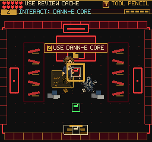
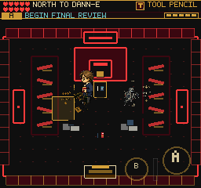
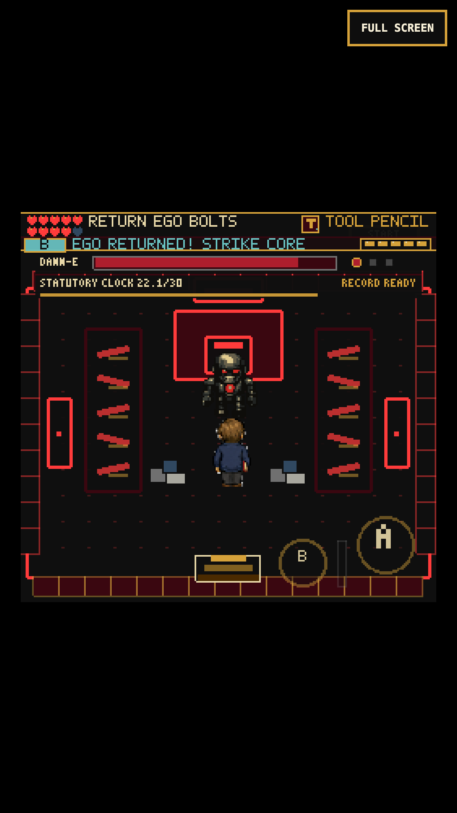
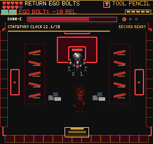

# Black Vault Readability

Local gameplay pass, September 5, 2026. Original FRUS adventure art and the
256x240 canvas are retained. No new dependencies, save schema, boss damage,
weapon timing, room-clear rules, or publication requirements.

## What Changed

- Removed the floating core banner and duplicate interaction boxes that covered
  the player and guard warnings. Small existing terminal, volume, and source-note
  sprites now sit at the real interaction coordinates. One floor outline names
  the selected object spatially; the existing HUD says what A/Z will do.
- Core guidance reads `BEGIN FINAL REVIEW`; the south doorway names the actual
  return destination. No extra HUD row, map text, or permanent instructions.
- The human-review cache restores up to its original 20 reliability points.
  At full reliability it stays unspent, gives short feedback, and the objective
  points north. A used cache disappears and remains used after Continue.
- Claimed Fragment III hotspots are removed, including on saved boss-cleared
  entries. The QA list no longer reports hidden cache/fragment/core props.
- When the boss starts, approach props, their selection outline, and cache
  feedback disappear. Fighting still requires the earned tool and reviewed record.
- Returned-bolt and damage feedback use the existing HUD action line, with the
  correct X/touch-B badge for counters and an exclamation mark for damage.
  Brief feedback expires during play, freezes during pause, and resets between
  phases. It no longer follows the player over bolts and enemies.

## Verification

- 163 Vitest files / 1,035 tests pass. Coverage includes cache objectives/refill,
  saved object visibility and hotspot removal, missing-art fallbacks, HUD cues,
  owned-tool parries, paused feedback, next-phase cleanup and final review gates.
- TypeScript and production build pass: 225 modules, main JS 2,712.59 KB
  versus 2,708.56 KB at the preceding commit. Existing chunk-size warning only.
- Desktop keyboard: a full cache remains unspent, the core starts the fight,
  an actual tool swing returns an Ego bolt, boss HP decreases, feedback survives
  a 1.8-second pause, and the normal counter cue returns. Deliberately standing
  in a later bolt reduces reliability 100 -> 90 and displays `EGO BOLT: -10 REL`.
- Chromium touch at 375x667 / DPR 3: cache 85 -> 100, Continue preserves the used
  cache, physical core approach/start works, and an actual B swing returns a bolt
  for 180 -> 152 boss HP. Pause preserves the feedback; it expires after resume.
  This replay takes one ordinary combat hit and is not a no-damage demonstration.
- Separate full-health touch check preserves the cache and physically exits
  south to Silent Read with reliability 100 and the cache still unspent.
- Guard regression: pause a fresh gold sweep warning for 3.2 seconds, resume and
  retreat without a hit during the dodge window. A paused player swing retains
  its frames, closing a later menu does not attack, and the next deliberate
  swing works. Existing sweep timings and collision bounds are unchanged here.
- All fourteen primary/expansion debug routes render nonblank, and playable
  scenes open the Map page and close to exploration without page/console errors.
- Required Playwright game client reaches Black Vault, moves and interacts,
  reporting valid state with no captured errors. Its direct WebGL-buffer PNG
  remains black; inspected renderer/compositor captures below provide visual proof.

## Evidence

Before, then after the floor-warning/prompt pass:

Detailed local runs: `/private/tmp/frus-vault-touch-final`,
`/private/tmp/frus-vault-desktop-final`, `/private/tmp/frus-vault-return-mobile`,
`/private/tmp/frus-vault-warning-final`, `/private/tmp/frus-vault-scene-regression`,
and `/private/tmp/frus-vault-required-client`.

## Replay And Limits

1. Continue a reviewed pre-boss save. At full reliability, inspect the cache;
   it must remain available. With damage, it heals once and disappears.
2. Walk toward the center console. The HUD names the final review, while the
   outline stays around the console and guard warning rectangles stay visible.
3. Begin review, face an incoming bolt and swing X/touch B when it approaches.
   Return it, then close in during the stun. Pause during feedback and resume.
4. Leave a later bolt uncountered to check the damage line and normal cue return.

The cache/boss tests reuse previously earned-tool save data, changing only the
entry position/scene, cache flag and starting health for bounded QA. These are
not a new full-game completion. Initial automation swung before the projectile
could reach the active hitbox; the corrected replay responds to its visible
position, without changing weapon timing. One assertion sampled state before
the HUD's next frame and was corrected to await the rendered cue. An earlier
guard retreat started with only 249 ms of warning; the successful regression
starts during a fresh warning, not by extending the game's attack timer.

No public deployment, real iPhone/Safari validation, or locked-60-fps claim.
Remaining broad goals include coherent enemy art, codex readability, fresh-run
pacing and real-device testing. This encounter pass does not complete that goal.
