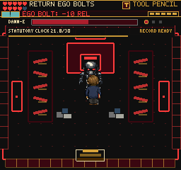
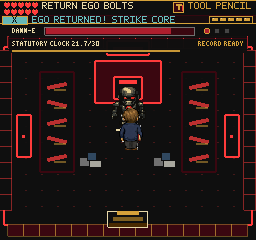
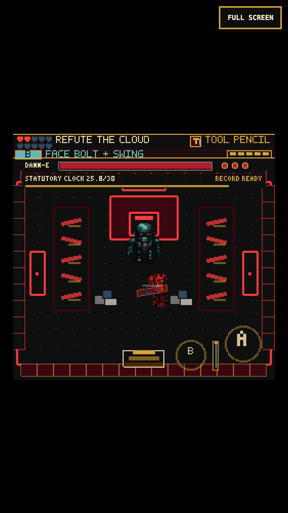
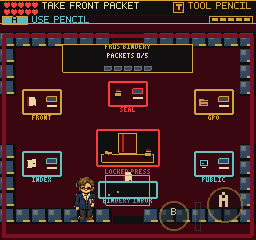

# Black Vault Counter Loop

Local gameplay checkpoint, September 5, 2026. This changes the critical-path
`DanneBoss`, not the separate room-enemy roster, player input or save format.

## Why

An earned save from the completed proofing route exposed a shortcut through
the fight: three ordinary Red Pencil swings reduced Colossus from 180 to 96 HP
with zero returned Ego bolts. The Guide taught a counter that the finale did
not actually need. The former 1,400 ms stun was also tight for closing distance
and recovering the returning swing.

## Play

1. Read the target and face an incoming Ego bolt. An owned Citation Stamp,
   Red Pencil or Review Folder returns it during active swing frames.
2. The returned impact deals the existing 28 damage and opens the core for
   2,000 ms. The boss turns pale; a shrinking 24x2-pixel strip marks the opening.
3. Close in and make a **new** Red Pencil swing. It deals the original 28 damage,
   or 14 against Cloud. The Ruby Pen retains its existing damage upgrade.
4. Retreat when the opening closes. Protected swings do no damage and recoil
   with `ARMORED: RETURN A BOLT`; wrong tools at an open core request the Pencil.

The return itself remains useful without a follow-up. A returning swing cannot
also deal melee damage during the same active window. All four combat phases
use the same protection rule, including the optional Ascendant phase.

No new source art or dependencies. HP, incoming damage, attack patterns,
publication clock, record-readiness gates, recovered combat pressure and
one-time rewards stay intact. `bossCombat.coreOpen` is transient QA state.
Pause preserves the opening, and retry, transitions and disposal hide the strip.

## Verification

- 169 Vitest files / 1,130 tests pass. New coverage checks protection in all four
  phases, a fresh follow-up, exact closing time, two separate hits, wrong/missing
  tools, Ruby Pen, active-frame limits, pause and phase cleanup. Existing tests
  still enforce reviewed-record requirements and temporary-pressure recovery.
- TypeScript and production build pass: 231 modules, main JS 2,729.87 KB,
  +1.30 KB versus `1eedfb4`. Only the existing large-chunk warning.
- Earned keyboard run completes normal 180-HP Colossus, Swarm and Cloud, then
  enters the bindery. Recorded boss-loop wall time: about 47 seconds, including
  pause/capture overhead; no retry. This is not a frame-rate benchmark.
- Actual Chromium touch events at 375x667 / DPR 3 complete those same phases
  with one Cloud retry, in about 86 seconds. D-pad movement, B counters, fresh
  follow-ups, pause and retry work without granting tools or boss-clear flags.
- Both runs keep 201 document points, count each defeated phase once, recover
  temporary combat losses to 100 reliability, reach five volume pieces, and
  leave the deadline unmissed. Binding packets are still 0/5: entering
  `EndingScene` is **not** publication or proof of whole-game completion.
- The portable replay repeats the earned desktop fight in about 76 seconds
  with one Cloud retry, then reloads through Continue. Documents, inventory,
  points and one-time phase counts survive; the bindery remains unbound.
- Two touch Continues from the genuinely earned mobile bindery save preserve
  the same documents, inventory, 201 points, 100 reliability and one defeat per
  phase. They do not complete any binding packet or award another boss reward.
- Fourteen existing scene-debug routes render nonblank; playable routes open
  the Map page and return from pause without page/console errors.
- The required game client returns a real bolt for 180 -> 152 HP in both
  headless and headed Chromium. Its direct WebGL-buffer PNG remains black;
  inspected renderer/compositor captures are the visual evidence.

## Replay

`tools/qa-boss-counter-loop.mjs` consumes an earned Black Vault entry browser
storage file, such as the output of `tools/qa-proof-comparison.mjs`. It does not
edit the saved documents, inventory, boss HP, phase or clear flags. Set
`FRUS_QA_STORAGE`; optional `FRUS_QA_URL`, `FRUS_QA_OUT`, `PLAYWRIGHT_MODULE` and
`CHROMIUM_EXECUTABLE` select the existing preview and browser runtime. Run with
`--mobile` for touch; `--baseline` is only for the preceding free-melee build.

The replay starts through Continue and the physical core interaction. It checks
protected hits, returns, fresh strikes, paused exposure, phase completion and
the real bindery transition and another Continue. Evidence saves and screenshots are written beside
its result. No real iPhone/Safari, gamepad, secret Ascendant playthrough or
locked-60-fps certification is claimed.

An initial script tried to stand in the solid rubble below Cloud's side perches.
Two touch attempts failed late in the fight. The successful replay uses the
clear center aisle, longer thumb holds, a position outside the orbiting minis,
fewer mid-combat captures and the existing current-phase retry. These failures
are not silently counted as passes. No collision bypass or damage cheat was used.

An approach swing can naturally return a bolt while being tested. The replay
therefore checks protected melee only when no return/exposure occurred; it no
longer mistakes legitimate counter damage for free melee damage.

## Screenshots

## Next

The bindery still contains 38 checks across five packets, with tiny station
labels. Its post-boss pacing is the next priority. Mixed character art, the
source-note metadata trail and real-device input/performance testing also
remain. This checkpoint is local only, not a public deployment or completion
of the broader fun/adventure goal.
