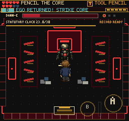

# DANN-E Imprecise Input Audit

September 9, 2026. Local build following a85836d. No combat values changed.

## Why This Check

The main counter-loop regression reads bolt coordinates to schedule swings.
That is useful for collision verification, but cannot establish how forgiving
the fight feels. Added `--imprecise` to the existing browser audit as a separate
observation mode; it does not replace the full-fight regression.

After the earned entry and normal approach, it attempts 16 swings at fixed,
uneven delays (420, 760, 500, 620 ms, repeated), nudging north every fourth
attempt. No HP, projectile position or core-opening state drives those inputs.
The setup still knows the central aisle and correct tool, so this is emphatically
not an unaided novice playtest. Reporting state is read after the sequence.

## Results

| Input | HP Before | HP After | Bolts Returned | Reliability Lost During Sequence | Retry |
| --- | --- | --- | --- | --- | --- |
| Simulated touch, 375x667 | 180 | 40 | 3 | 10 | No |
| Keyboard, 1024x960 | 180 | 96 | 1 | 20 | No |

Both runs started the measured sequence at 90 reliability; the approach had
already cost 10. Documents and points remained unchanged. No browser errors.
These are single observations with real-time scheduling differences, not an
estimate of device superiority, a timing threshold, or a win-rate claim.

Evidence:
- `/private/tmp/frus-boss-imprecise-touch-0909/result.json`
- `/private/tmp/frus-boss-imprecise-desktop-0909/result.json`

Native touch and keyboard captures inspected. The standard installed game client
also approached from an earned entry using ordinary keyboard bursts; its separate
capture is not counter-loop proof. The attempted interactive Chrome debug visit
was not used as earned or novice evidence.

## Decision

Do not widen exposure windows or lower HP simply because the precise regression
looks demanding. Imperfect swings can produce returns and follow-up damage with
recoverable mistakes. Preserve the counter-and-core mechanic while seeking
first-player evidence about recognizing the required button, return timing and
follow-up approach. The broader fun goal remains unproven.

Validation: script syntax and diff checks pass. No runtime source or assets were
changed in this checkpoint; the previously verified build remains in use.

## Cloud Follow-up After Faster Movement

September 12, 2026, following `f7ee061`. Added `--cloud-imprecise` to the
earned counter-loop test. Normal gameplay reaches Cloud; the probe then
stands in the central aisle and attempts 16 swings using the same uneven
cadence. Before each swing it faces the visible relative enemy position.
It does not read bolt coordinates, HP, telegraph timers or the core window
to decide swing timing. Scene/phase checks only stop the probe on interruption.

| Input | HP Before | HP After | Returns During Probe | Reliability Before / After | Retry |
| --- | --- | --- | --- | --- | --- |
| Simulated touch, 375x667 DPR3 | 180 | 96 | 3 | 90 / 70 | No |
| Keyboard, 1024x960 DPR1 | 180 | 40 | 6 | 90 / 90 | No |

Both probes preserved documents and points and reported no browser errors.
The subsequent timing-aware counter routine finished Cloud, entered the
bindery and passed Continue, with no retries or deadline misses. That finish
must not be attributed to untimed input alone. The differing results are two
real-time observations, not evidence that keyboard is inherently easier.
Native probe-end screenshots were inspected and retained.

Evidence: `/private/tmp/frus-cloud-untimed/` and
`/private/tmp/frus-cloud-untimed-keyboard/`, including per-probe summaries in
`result.json`. Images: `screenshots/cloud-untimed-touch.png` and
`screenshots/cloud-untimed-keyboard.png`.

Decision: preserve HP, damage and counter windows. Untimed imperfect input
can produce meaningful Cloud progress without requiring a retry. Recognition
of the return-and-core mechanic still needs first-player feedback; this probe
knows the correct tool and aisle, and does not approximate unaided discovery.
Script syntax and diff checks passed. No runtime code changed in this pass.
