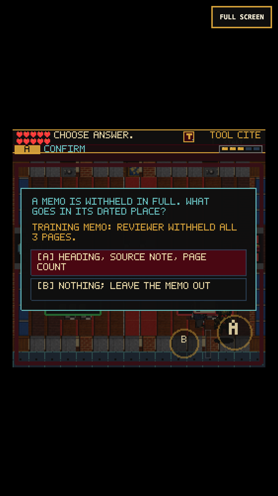

# ClassNet withholding ledger

## Why this changed

An earned-save playthrough showed that three desk visits automatically completed
the ClassNet review and exposed the Clearance Token. Delivery was standing in
for human judgment. The first two visits now explicitly file recorded review
paperwork; the final ledger requires one concrete editorial decision.

The case follows the [actual About the Series section](https://history.state.gov/historicaldocuments/frus1989-92v31/abouttheseries):
an entirely withheld document is accounted for chronologically by its heading,
source note and number of withheld pages. The three-page training memo is
fictional, not a document or withholding statistic from the cited volume.

## Player experience

- Carry the same three-docket batch through HUMAN, RELEASE and LEDGER.
  These shortened labels fit their signs. The first two handoffs remain quick.
- At the ledger, choose whether to account for the withheld memo or omit its
  entry. One compact two-option prompt replaces automatic completion, not a
  nine-question sequence.
- A rejected proposal is not applied. The docket stays in hand, no reliability
  or points are lost, and a short reminder permits immediate correction.
- DANN-E, his projectiles and the player stop while the decision is open.
  Selecting an answer cannot also start a tool swing.
- Accounting for the memo reveals the existing Clearance Token. Collecting it
  opens the physical eastern route to Referral Vault.

No save schema, inventory, reward amount, input binding, art asset or room graph
changes. Existing completed review saves remain complete. An unfinished ledger
reloads at the saved position with its docket still held.

## Verification

- 167 test files / 1,095 tests pass. Tests cover pending/rejected/accepted
  decisions, order and station gates, duplicate completion, retained docket,
  legacy restoration, prompt/sign dimensions and scene update ordering.
- Production build passes: 227 modules; main JS 2,718.94 KB, up 1.36 KB from
  the prior build. The existing Vite large-chunk warning remains.
- Real-clock Chromium keyboard and 375x667 / DPR-3 touch runs continue an earned
  Archive exit save. Both finish Network routing, retain batches across reload,
  recover from wrong destinations, make and correct the ledger decision, collect
  the token and physically enter Referral Vault. No injected completion flags.
- Both compare player, weapon, DANN-E/projectile and reliability state over
  2.2 seconds of reading. Answer input does not create an extra swing. Neither
  run reports page/console errors or horizontal page overflow.
- Fourteen scene routes render nonblank and round-trip through their available
  pause maps without page/console errors.
- The required web-game client was run headed and headless. Direct WebGL-buffer
  captures remain black; native renderer and compositor captures were inspected
  and are nonblank. Initial virtual-time bursts preceded the scene-entry input
  unlock; waiting for the real Continue transition fixes the test setup.

## Repeat the earned playthrough

Use `tools/qa-guide-counter.mjs`, then `tools/qa-archive-wall.mjs` to produce
the earned Network-entry storage. With a production preview running:

```sh
FRUS_QA_STORAGE=/tmp/frus-archive-wall-desktop/earned-storage.json \
  node tools/qa-network-ledger.mjs
FRUS_QA_STORAGE=/tmp/frus-archive-wall-desktop/earned-storage.json \
  node tools/qa-network-ledger.mjs --mobile
```

`FRUS_QA_URL`, `FRUS_QA_OUT`, `PLAYWRIGHT_MODULE` and `CHROMIUM_EXECUTABLE`
override local paths. The replay writes state, native/compositor screenshots,
pending-ledger storage and an earned Referral-entry save. It closes the browser
even if an assertion or evidence write fails.

## Screenshots





## Remaining work

This verifies a local chapter change, not a new full-game completion, public
deployment, locked-60-fps benchmark or actual iPhone Safari certification.
Continue the earned playthrough in Referral Vault. Its repeated handoffs and the
remaining legacy floating reward banners need a separate pacing/readability
review. Broader source-note metadata and mixed older character art remain open.
