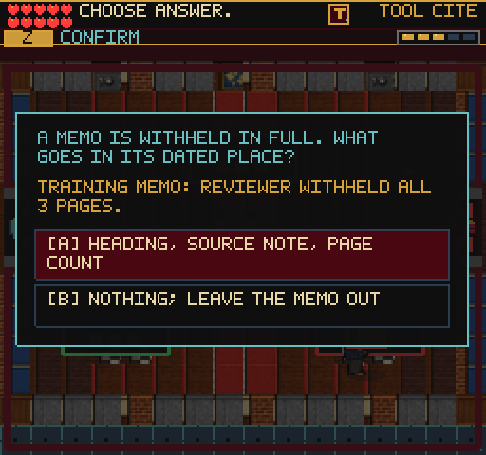
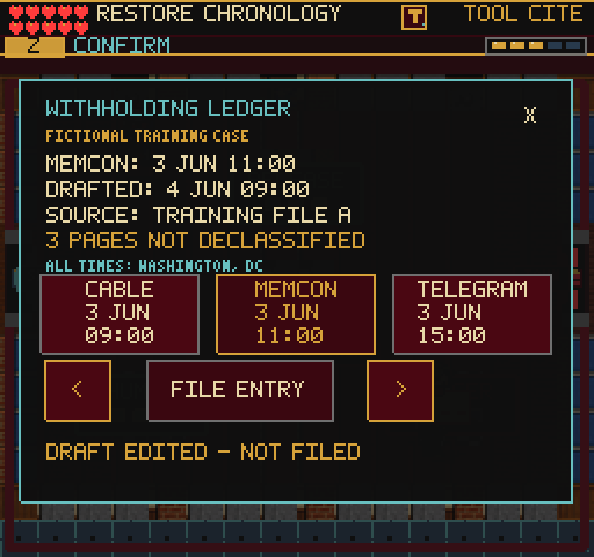
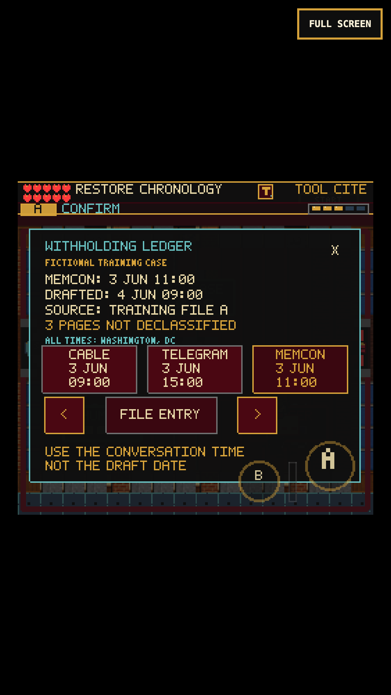
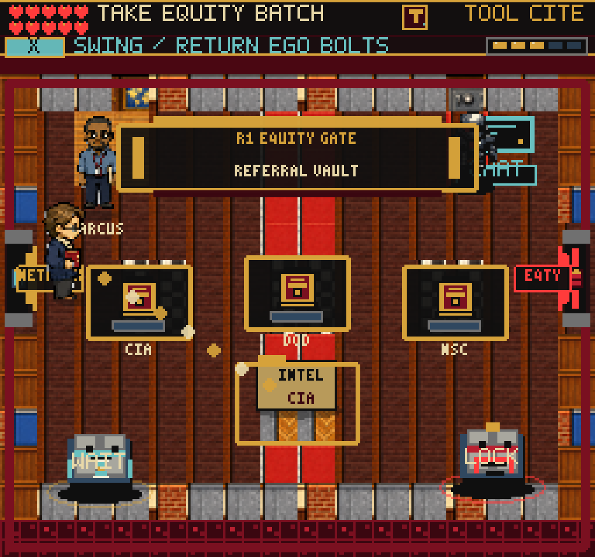

# ClassNet withholding ledger

## Why this changed

The first version replaced automatic completion with a two-answer withholding
question. A subsequent earned-save replay found that the answer was obvious
without inspecting a document. The final ledger now presents an editable
chronology: reconstruct a missing entry and explicitly file the corrected draft.
The first two review-paperwork handoffs remain quick.

The case follows the [actual About the Series section](https://history.state.gov/historicaldocuments/frus1989-92v31/abouttheseries):
an entirely withheld document retains a chronological entry with its heading,
source note and number of withheld pages. Memoranda of conversation are ordered
by conversation time, not drafting time; dates use Washington, DC time.
The three-page memo, other records, dates and TRAINING FILE A locator are
fictional evidence, not documents or withholding statistics from the cited volume.

## Player experience

- Carry the same three-docket batch through HUMAN, RELEASE and LEDGER.
  These shortened labels fit their signs. The first two handoffs remain quick.
- At the ledger, a 09:00 cable and 15:00 telegram are already placed. Insert
  the withheld 11:00 memcon between them, despite its next-day drafting date.
  Its heading, source note and withheld-page count stay visible. No text is released.
- Left/right arrows move the entry; up/down switches keyboard selection between
  ordering and filing. A advances one slot while ordering or submits while FILE
  ENTRY is selected. The same visible buttons accept mouse and touch input.
- Filing a missing or misplaced entry produces a short corrective hint. The
  board stays open, the docket stays held, and no points or reliability are lost.
  Even a correctly ordered draft needs explicit filing before the reward appears.
- B/Esc or the close control dismisses the board. Every edit is saved, including
  wrong drafts. Continue restores the exact placement without approving it.
- DANN-E, his projectiles and the player stop while the decision is open.
  Editing, filing and closing cannot also start a tool swing.
- Accounting for the memo reveals the existing Clearance Token. Collecting it
  opens the physical eastern route to Referral Vault.

No save schema, inventory, reward amount, input binding, art asset or room graph
changes. The existing numeric sceneProgress record stores classNetWithholdingSlot:
0 missing, 1 before cable, 2 between records, 3 after telegram. Invalid values
restore as missing. Existing completed review saves remain complete without this
field. An unfinished ledger reloads at its saved position with its docket held.

## Verification

- 182 test files / 1,265 tests pass. Tests cover all entry positions, invalid
  saved values, conversation/draft-date distinction, station gates, duplicate
  completion, real save round-trips without credit, legacy restoration,
  native text widths and scene update ordering.
- Production build passes: 244 modules; main JS 2,774.86 KB, up 4.92 KB from
  the prior build. The existing Vite large-chunk warning remains.
- Real-clock Chromium keyboard and 375x667 / DPR-3 touch runs continue an earned
  Archive exit save. Both finish Network routing, retain batches across reload,
  recover from wrong destinations, edit and file the ledger entry, collect
  the token and physically enter Referral Vault. No injected completion flags.
- Both compare player, weapon, DANN-E/projectile and reliability state over
  2.2 seconds of reading. Puzzle input does not create an extra swing. Neither
  run reports page/console errors or horizontal page overflow.
- Fourteen scene routes render nonblank and round-trip through their available
  pause maps without page/console errors.
- Focused keyboard, mouse and touch runs reject omitted, early and late entries,
  save a correct-but-unfiled draft, close without input falling through, reload,
  edit again, file, collect the token and exit. Measured controls are at least
  44 CSS pixels, mutually disjoint, and outside the touch A/B hit regions.
  An edge-tap check caught Phaser retaining the original smaller hit area;
  registering the custom area before the pointer binding fixed it. Final mouse
  and touch replays exercise the area outside each visible arrow successfully.
- A genuine completed pre-puzzle save returns from Referral Vault and interacts
  with the ledger without reopening it or changing documents, inventory or points.
- The required web-game client was run headed and headless. Direct WebGL-buffer
  captures remain black; native renderer and compositor captures were inspected
  and are nonblank.

## Repeat the earned playthrough

Use `tools/qa-guide-counter.mjs`, then `tools/qa-archive-wall.mjs` to produce
the earned Network-entry storage. With a production preview running:

```sh
FRUS_QA_STORAGE=/tmp/frus-archive-wall-desktop/earned-storage.json \
  node tools/qa-network-ledger.mjs --crossing
FRUS_QA_STORAGE=/tmp/frus-archive-wall-desktop/earned-storage.json \
  node tools/qa-network-ledger.mjs --crossing --mobile
```

`FRUS_QA_URL`, `FRUS_QA_OUT`, `PLAYWRIGHT_MODULE` and `CHROMIUM_EXECUTABLE`
override local paths. The replay writes state, native/compositor screenshots,
pending-ledger storage and an earned Referral-entry save. It closes the browser
even if an assertion or evidence write fails.
Use --ledger-only with pending-ledger.json for the shorter puzzle replay;
--pointer uses mouse puzzle controls. Use --completed-return with an earned
pre-puzzle Referral-entry save for the legacy compatibility check.

## Screenshots

Before: the two-answer decision.



After: editable, explicitly filed chronology.







## Remaining work

This verifies a local chapter change, not a new full-game completion, public
deployment, locked-60-fps benchmark or actual iPhone Safari certification.
The 375x667/DPR-3 probe reports a 341.328x320 CSS canvas, backing 256x240,
computedZoom 1.333313, but integerZoom true. That pre-existing scaling/readout
disagreement needs a dedicated rendering pass; these checks do not certify the
integer-scaling bar. Mobile movement also took more incidental DANN-E damage
than keyboard in these replays; measure novice pathing and pressure separately.
Continue the earned route through Referral/Editor for pacing. Broader
source-note detail, mixed older character art and real-device Safari remain open.
