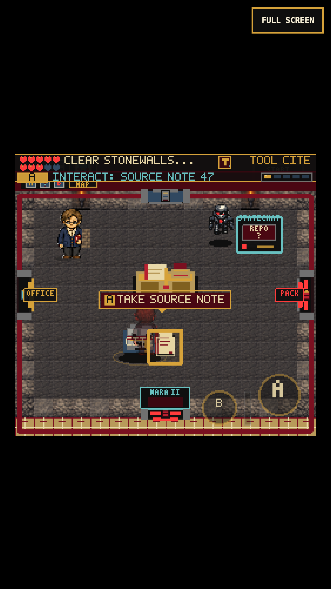
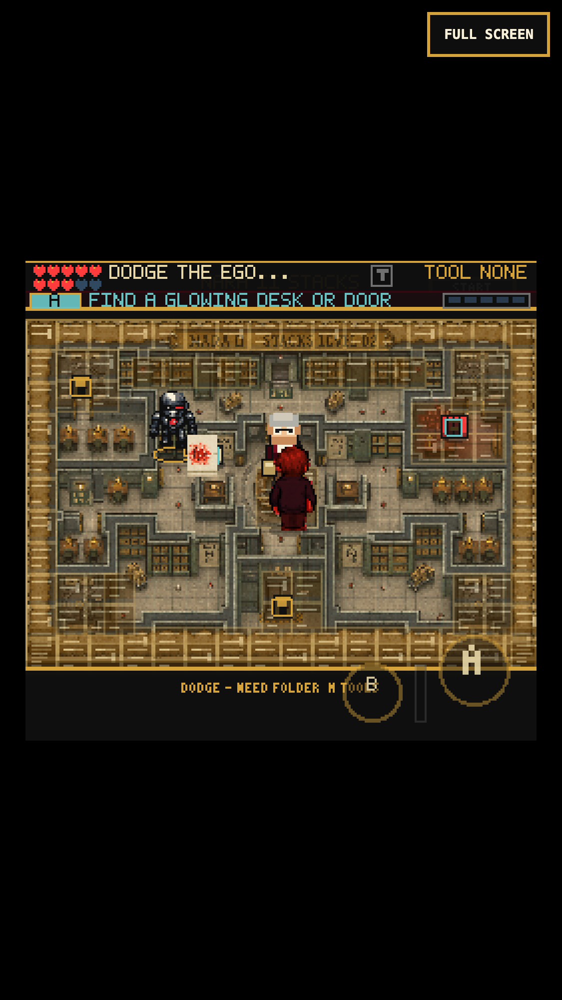
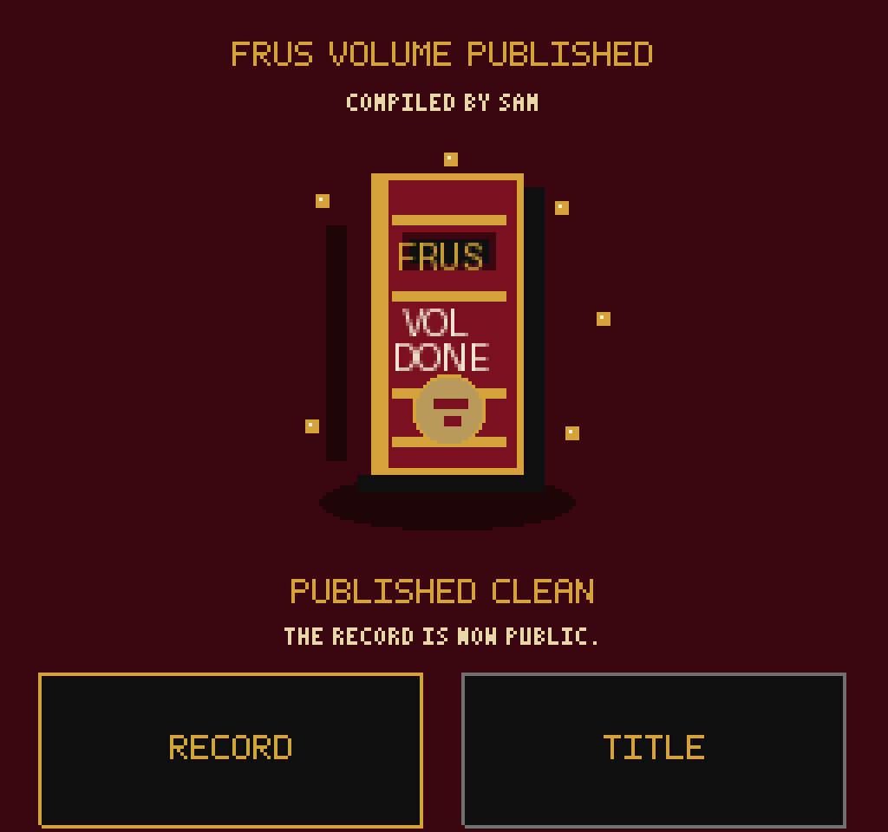
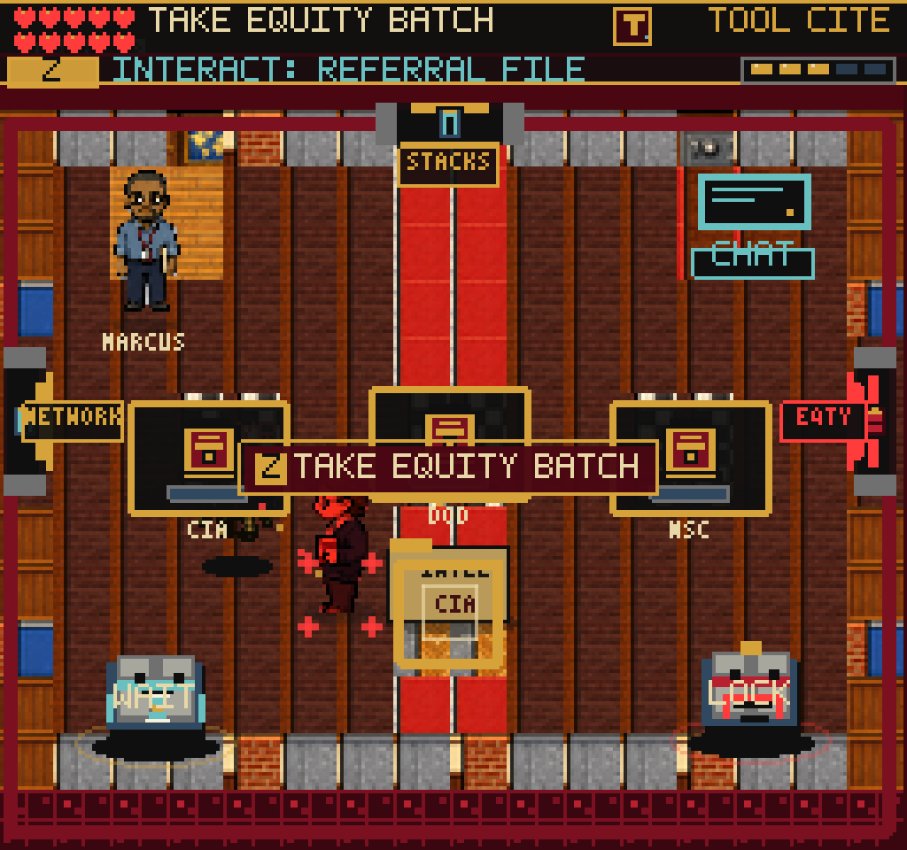
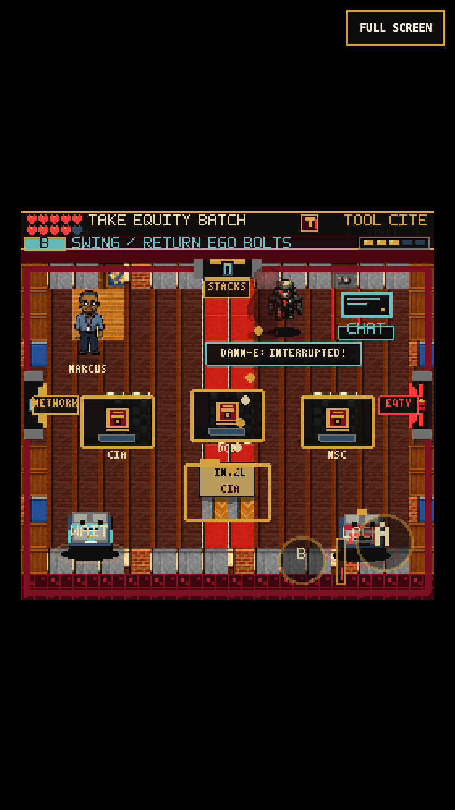

# Combat Pressure, Not False Publication Failures

## Reproduced Problems

1. On an earned Archive entry, walking left and then up into NO REPO deducted
   four reliability points and recorded `missed_30_year_deadline`. A second
   collision produced a repeat count of two. Continue retained the unresolved
   entry, despite the statutory clock never having started. Final human
   certification treats unresolved deadlines as blockers.
2. NARA Stacks' Mark I fired diagonal Ego bolts which stayed at (74, 78).
   The observed velocity was approximately (21.006, 26.735) pixels/second, but
   five samples between scene times 2436 and 3853 ms showed no displacement.
   Each frame rounded away the movement before the next frame could use it.

## Changes

- `applyProcessPressure` preserves the old four-point hit cost, clamping,
  sound, knockback, recovery windows, and room-clear requirements. Archive
  wall collisions and GameplayMapScene enemy hits use this path rather than
  writing a standards violation. Feedback states that the record is unchanged.
- The actual DanneBoss statutory-clock expiry still records a deadline failure.
  Unindicated edits and other genuine standards findings still block publication.
- Continue mechanically corrects only nine exact, previously generated collision
  contexts, and only for non-document deadline entries. It retains the records,
  IDs, count, context, and lost reliability, marking those erroneous blockers
  resolved. It changes neither documents nor rewards. Unknown wording, actual
  deadline contexts, other violation types, and document-scoped findings remain.
  A short restoration message replaces the misleading old hit message.
- Expansion Ego bolts now retain precise coordinates and reuse `advanceBossBolt`,
  already used by the final boss. Only drawing and the matching collision bounds
  are snapped. Speed, lifetime, cooldown, damage, and projectile cap are unchanged.
  Slow shots travel consistently rather than stopping on high-refresh displays.
- The text QA mission readout distinguishes reliability damage from record faults.

## Verification

- `npm test -- --pool=threads --maxWorkers=2`: 176 files, 1,215 tests pass.
  Includes 22 new cases: pressure loss and zero clamp, exact legacy-context
  repair, repeated Continue, preserved evidence/rewards, genuine blockers,
  certification readiness, diagonal travel at 30/60/120/144 fps, and one-hit
  projectile removal. Existing pause/lifetime tests remain green.
- `npm run build`: passes, 237 modules, main JS 2,751.20 KB. The existing large
  chunk warning remains. No dependencies, assets, or save schema were added.
- `tools/qa-process-pressure.mjs`: real keyboard and CDP touch actions at
  375x667/DPR 3. Both walk into the moving wall, take damage, pause without
  further damage or movement, Continue, and retain an unaltered record. Both
  also take a live Mark I bolt in the NARA debug room without clearing its gate
  or creating a violation. No console/page errors.
- Legacy verification uses a real pre-fix save, not a fabricated completion:
  the baseline was served from the four changed production files at `b3901f5`,
  and actual contact plus pagehide/Continue produced the saved two-hit ledger.
  The repaired build loads that same save at 72 reliability, with the same
  documents and points, and no unresolved collision entry. The temporary
  baseline server was stopped afterward; the working tree was never reverted.
- Fourteen existing scene debug routes render nonblank and pass pause/map return
  checks where applicable. This includes the main chapters and expansion scenes.
- The required skill Playwright client exercises wall and bolt hits. Its direct
  WebGL-buffer screenshots remain black in both headed and headless modes;
  inspected native-renderer and compositor captures show the actual game.

### Replay

Use `PLAYWRIGHT_MODULE` and `CHROMIUM_EXECUTABLE` for the installed browser,
`FRUS_QA_STORAGE` for an earned Archive-entry storage file, and optionally
`FRUS_QA_LEGACY_STORAGE` for a pre-fix affected save. `FRUS_QA_URL` and
`FRUS_QA_OUT` select the preview and evidence directory.

```sh
node tools/qa-process-pressure.mjs
node tools/qa-process-pressure.mjs --mobile
```

Evidence directories:

- `/private/tmp/frus-pressure-verified-baseline`
- `/private/tmp/frus-pressure-desktop-verified`
- `/private/tmp/frus-pressure-touch-verified`
- `/private/tmp/frus-pressure-scene-smoke`
- `/private/tmp/frus-pressure-required-final` and its `-headed` counterpart

## Fresh Earned Critical Path

One fresh desktop save chain completed Warning -> Title -> Character Create ->
Office -> Guide counter -> Archive -> both Networks -> Referral -> Editor/Proof
-> DANN-E -> binding/publication. Each chapter consumed the preceding chapter's
earned save; no tools, flags, boss kills, or document decisions were granted.
This was a checkpointed automated playthrough with intentional mistakes,
cancellations, and reloads, not an uninterrupted human pacing benchmark.

Replay chain: `qa-guide-counter.mjs`, `qa-archive-wall.mjs`,
`qa-network-ledger.mjs`, `qa-referral-manifest.mjs`, `qa-proof-comparison.mjs`,
`qa-boss-counter-loop.mjs`, `qa-bindery-finale.mjs`.

The final fight completed Colossus, Swarm, and Cloud using eight counter cycles
and no retries, without missing the deadline. Final publication retained all
five pieces, 241 points, 100 reliability, three boss-phase defeats, and zero
unresolved equities/standards findings after Continue. A separate touch replay
of that earned bindery entry also published and resumed at 241 points.

Artifacts are under `/private/tmp/frus-fresh-pacing-{opening,archive,network,referral,proof,boss,finale}`
and `/private/tmp/frus-fresh-pacing-finale-touch`.

## Remaining Playability Work

The opening's returned-bolt reward and final boss provide clear physical
challenges. The middle still relies too heavily on repeated desk routing;
exploration rewards, short spatial tool puzzles, and less repeated travel are
the next priority. Older mixed-resolution art and crowded optional map dressing
remain visible. Also audit other entities for rounded-coordinate integration;
this fix covers expansion Ego bolts, not every moving object in the game.

This is local verification, not public deployment, real-iPhone Safari testing,
full optional-region completion, or a claim that the broad fun/adventure goal
has been achieved.

## Screenshots





## DANN-E Contact Fairness (2026-09-08)

The earned Referral entry reproduced a phantom hit: at player (88, 162),
DANN-E at about (69, 147) deducted reliability from 91 to 90 without touching.
The player's foot rectangle began at (80, 159); DANN-E's body ended at
(77.88, 153.04). The old 25-pixel radius treated that visible gap as contact.

`DanneLurker.update` now intersects the same 16x8 foot rectangle used by
`Player` terrain collision with the enemy's existing body. Touching rectangle
edges counts as contact, as in Phaser's terrain check. The five close-pass
regressions failed before the fix and pass afterward. Fifteen additional
cases cover near misses on four sides and diagonally, real overlaps, touching
edges, and the unchanged contact cooldown. The Phaser test double now matches
the engine's inclusive rectangle-edge behavior.

Preserved: one-point contact damage, two-point Ego bolts, invulnerability,
active-window tool counters before contact, pauses, doorway grace, safe Office
foreshadowing, and the quiet Dispatch Stacks. Combat still does not create a
standards violation. No inventory, document, room graph or save changes.

### Current Verification

- Full suite: 182 files / 1,295 tests pass. Build passes, 244 modules, main JS
  2,775.57 KB (+0.09 KB). Existing large-chunk warning only.
- Real-input keyboard and 375x667/DPR-3 simulated touch contact replays each
  show zero phantom damaging contacts and one deliberate damaging contact.
  Both interrupt DANN-E using the earned Citation Stamp; touch holds direction
  and B simultaneously. The touch observer also records 203 nearby frames
  without contact. Documents, document points and standards stay unchanged.
- Full keyboard Referral replay passes through routing, intentional mistakes,
  the Dispatch Stacks copy and shortcut, editable human review, cancellations,
  Continue, reward and backtracking. Editor handoff: 114 document points,
  100 reliability, Concurrence Slip held, no standards violations.
- Fourteen scene debug routes render and pass pause/map return checks, with no
  page or console errors. The required skill client moves and swings in the
  actual room; native-renderer and compositor captures were inspected because
  its direct WebGL-buffer screenshot is black.

Replay with an earned Referral-entry `FRUS_QA_STORAGE`, plus the installed
`PLAYWRIGHT_MODULE`, `CHROMIUM_EXECUTABLE`, `FRUS_QA_URL` and `FRUS_QA_OUT`:

```sh
node tools/qa-danne-contact.mjs --observe # Record an unmodified baseline
node tools/qa-danne-contact.mjs           # Assert contact and Stamp counter
node tools/qa-danne-contact.mjs --mobile  # Simultaneous D-pad and tool input
node tools/qa-referral-manifest.mjs       # Complete chapter regression
```

The contact observer wraps the real update without changing inputs, results,
positions or progression. It records the pre-knockback player footprint,
enemy body, and reliability before/after the same frame. This is browser
simulation, not real-iPhone Safari or latency certification, and is not a
complete optional-world playthrough or a claim that the fun goal is finished.

Evidence: `/private/tmp/frus-contact-before-0908`,
`frus-contact-desktop-fixed-0908`, `frus-contact-touch-final-0908`,
`frus-referral-contact-regression-0908`, `frus-contact-required-0908`, and
`frus-contact-scenes-0908` under the same temporary root.




Remaining concrete follow-up: the required-client capture at (53, 150) shows
the compiler hidden by the CIA station. Referral's station containers use a
fixed depth of 150 rather than their physical foot position, and R1's furniture
lacks matching solid footprints. Reconcile those together, preserving roomy
approaches and the existing interactions. Also check the crowded Editor entry
card seen at the chapter handoff. These are not repaired by the contact fix.
