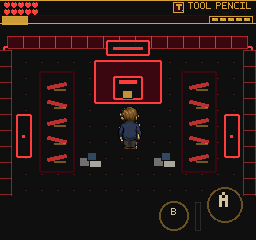
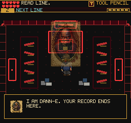

# Cutscene Prompt Timing

September 9, 2026. Local preview only.

The ordinary keyboard client captured READ LINE / NEXT LINE while no boast was
visible. Code inspection confirmed a real transition gap: enterCutscene sets
dialog mode before its 300 ms entrance tween finishes; playLine follows that
tween. UIScene previously interpreted dialog mode alone as readable dialogue.

The quest band now withholds objective, action text and input badge while in
dialog mode without nonblank active-dialog text. Once the line exists, normal
localized reading cues return. Hearts, tools and the HUD geometry stay in place.
Combat timing, pause, input handling, saves and cutscene reading duration are
unchanged. Refresh still follows the existing HUD update cadence.

## Evidence

- Unit cases cover absent text, whitespace, a real line and non-dialog modes.
- All 195 test files / 1,458 tests pass.
- Build passes: 255 modules; main JS 2,802.79 KB, existing chunk-size warning.
- Touch audit captures the empty transition, visible boasts, held clock/player,
  safe advancement and return to combat:
  `/private/tmp/frus-boast-arrival-after-0909/`.
- Keyboard audit additionally asserts the localized reading cues reappear:
  `/private/tmp/frus-boast-arrival-desktop-fixed-0909/`.
- The first keyboard assertion incorrectly expected uppercase READ LINE rather
  than the stored English string `Read line.`. That run timed out; it is not a
  passing gameplay result. Corrected the assertion and reran from the earned save.
- Installed keyboard client reproduces the approach and captures readable text:
  `/private/tmp/frus-boast-arrival-client-0909/native.png`.
- Native screenshots inspected. These scoped runs do not replace the earlier
  full-fight regression or establish novice comprehension.

