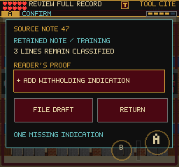

# Editor Discovery Audit

September 9, 2026. Local preview only.

## Observed Play

Played the earned Referral handoff through Editor and Silent Read Tower using
simulated 375x667 touch input, ending at the Black Vault. The chapter awarded
87 document points; the run reported no browser errors. Partial correction,
catalog match, release scope, chronology, printer proof, backtracking and
Continue were exercised. Evidence:
`/private/tmp/frus-editor-discovery-0909/mobile/`.

The chronology and original-versus-typeset comparison screens make evidence
inspection the task, rather than merely accepting a dialog. However, this is a
guided regression run, not evidence that a new player finds the sequence fun.
Eight successive review items in the same two rooms still warrant an unaided
pacing test before adding more filing tasks.

## Change

The first repair field displayed `[ INDICATION MISSING ]`, which looked like a
read-only status even though it was the action button. It now displays
`+ ADD WITHHOLDING INDICATION`. After activation, the actual authored indication
replaces the command. The retained training note and separate FILE DRAFT step
remain unchanged. No document, save, reward, input or standards logic changed.

## Verification

- Build passes: 255 modules; main JS 2,802.62 KB; existing large-chunk warning.
- All 195 test files / 1,457 tests pass, including the visible command's
  replacement by the authored indication without automatic filing.
- Updated browser audit asserts both reported action and rendered text. Its
  `--editor-only` touch replay covers pickup, carry Continue, correction,
  cancellation, draft Continue, filing, stamping and Red Pencil reward.
- Post-change evidence: `/private/tmp/frus-editor-action-after-0909/mobile/`.
- The installed keyboard client resumed the earned uncorrected draft and opened
  the same control; its native capture was inspected at
  `/private/tmp/frus-editor-action-client-0909/native.png`.
- Native screenshot inspected: text stays within the control and does not
  overlap evidence, filing or return controls.
- Full baseline is before the copy-only change; post-change browser scope is
  explicitly the editor action, not another whole-chapter run.
- Simulator metrics are not a physical-device performance guarantee.

Next: inspect the earned Black Vault encounter and its transition from puzzle
pacing into action; separately test novice comprehension across these chapters.
