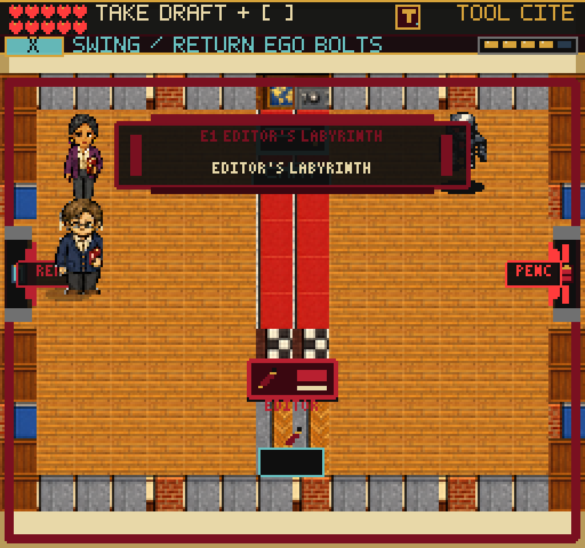
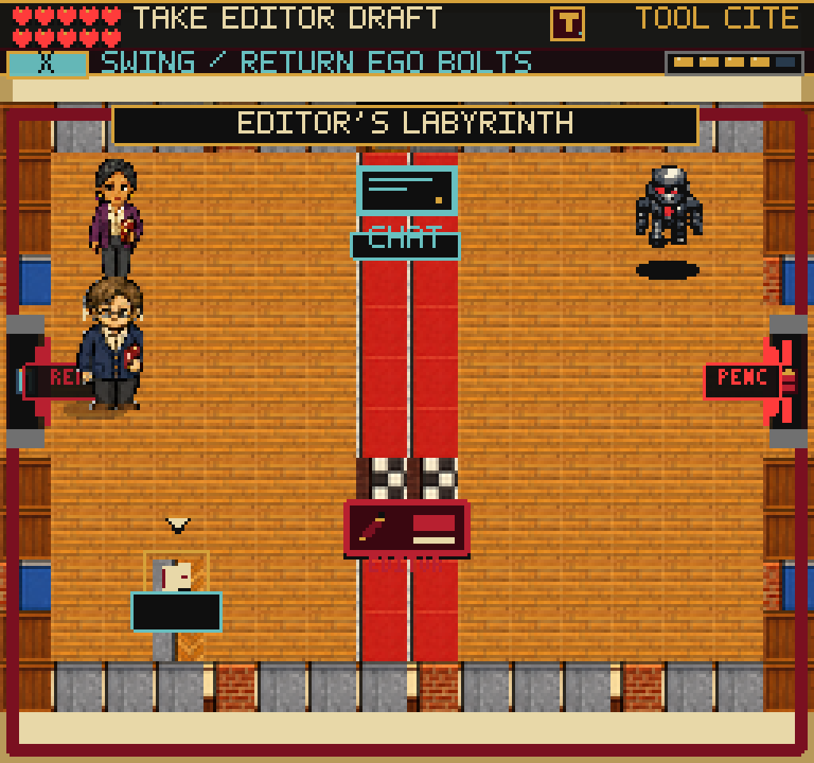
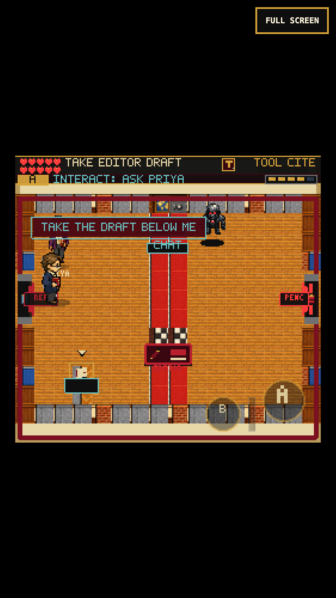

# Editor E1 Tilemap Promotion

Editor's Labyrinth E1 uses a real Phaser tilemap. Human editor verification,
the visible bracket, Red Pencil reward, DANN-E pressure, save fields, and S1 gate
remain intact. The September 8 handoff update separates the draft pickup from
the desk and makes the next action legible.

## Layer Map

E1 uses the manifest-backed native interiors sheet and explicit `firstgid: 1`
contract. The room is 16 columns x 12 rows at `(0, 32)`.

| Layer | Source indices | Purpose |
| --- | --- | --- |
| Ground | `0`, `2`, `5`, `7` | Warm office floor, ruby human-review lane, checker editor-desk pad, and parquet StateChat outbox pad. |
| Walls | `8`, `10`, `12`, `14` | Panel, metal, brick, and blue editorial perimeter. |
| Decoration | `24`, `28` | Sparse safe and bulletin-board wall cues. |

The east query gate remains open at rows `4..6`; every other perimeter cell is
collision. The locked gate stays physically reachable so the Red Pencil prompt
remains the authoritative progression rule.

## Conditional Declutter

When the packed map succeeds, E1 omits the fallback room layer, compass, large
StateChat panel, and two giant explanatory pages. A compact StateChat terminal,
Priya, DANN-E, one outbox, one editor desk, the physical route cue, and the east
gate remain. If the packed texture is absent, the older art remains as fallback;
the same updated pickup positions and interactions apply.

## Editor Handoff (2026-09-08)

- One cream-on-black room title sits on the north wall; the duplicate subtitle
  and large center banner are gone. Movement stays available during the title.
- The first objective is `TAKE EDITOR DRAFT`. Its image is a proof page, not the
  Red Pencil that the player has yet to earn.
- E1's draft tray is at `(56,192)`, with the pickup at `(56,182)`. Its parquet
  pad moved to column 3, rows 9-10. The Editor desk remains `(128,166)`.
  Pickup reach (24px) and intended desk reach (40px) no longer overlap.
  S1's outbox and every saved review status remain unchanged.
- A small outlined arrow marks the waiting paper. Carried-file dots sit on the
  floor rather than across the compiler, and disappear near the destination.
- Priya responds to the same A interaction as documents. Her one-line hint
  follows the waiting, carried, routed, verified, and completed states, and
  knows the late editorial-repair path. A reachable work item takes priority.
  Hints neither answer the review nor award points or items.
- Pressing A too far from a file or desk now shows brief visible feedback.
- Editor/proof prompts clear the compiler's head. Toasts use the actual sprite
  bounds, falling below the actor near the north edge if necessary. The toast
  helper is opt-in; other scenes retain their placement behavior.

The source-note repair board still requires a human to restore the withholding
indication, file the draft, and separately stamp approval. The same Pencil gate,
Proof Lens, Buckram Key, and 87-point chapter reward remain in force.

The strict workstation action radius is 32 pixels, with the existing additional
eight-pixel margin for the intended desk. This prevents a small DANN-E knockback
from turning an adjacent action into a one-pixel "step closer" failure while
keeping neighboring workstations distinguishable.

## Handoff Verification

- Full suite: 183 files / 1,314 tests pass, including seven new cases for draft
  identity, stateful hints, separate reach zones, and actor-aware toast placement.
  Use `npm test -- --pool=threads --maxWorkers=2` to avoid the previously observed
  fork-worker startup failures after browser-heavy runs.
- Production TypeScript/Vite build passes: 245 modules, 2,780.14 KB main JS
  (+2.20 KB). The existing large-chunk warning remains.
- Earned-save keyboard and 375x667 / DPR-3 touch replays both finish E1 -> S1 ->
  Black Vault at 201 document points, 100 reliability, and no standards findings.
  Each earns the original 87 points and the Red Pencil, Proof Lens, and Buckram
  Key. No progress grants or teleports are used.
- Both runs check Priya without changing earned progress, pickup/desk separation,
  Continue while carrying, partial bracket/proof repair, wrong answers, cancel,
  explicit filing followed by a separate stamp, and completed-room backtracking.
  Each records 37 screenshots and 26 real feedback/player bounds checks with no
  player overlap or horizontal clipping. No page or console errors.
- Fourteen debug-scene load/pause/map checks pass without browser errors.
- The installed web-game client also moves and interacts with Priya. Its headed
  compositor/native captures show the readable hint. The direct WebGL buffer
  capture is black, so it is not used as visual evidence. Waiting longer before
  this input burst allowed DANN-E to land two hits (100 -> 98 reliability); this
  short input check is not the full no-damage chapter replay.
- Real iPhone Safari and locked-60-fps performance are not certified. The touch
  run reports 20 ms p99 and an isolated 82 ms frame. Full-adventure novice pacing,
  physical proof-room furniture, and repetitive workstation travel remain work.

Reproduce the chapter with `node tools/qa-proof-comparison.mjs` and `--mobile`.
Set `FRUS_QA_STORAGE` to an actual earned Editor-entry browser storage file,
`FRUS_QA_OUT` to an evidence directory, and `PLAYWRIGHT_MODULE` /
`CHROMIUM_EXECUTABLE` to the installed browser runtime. Do not rebuild the served
`dist/` while a replay is reloading it.

Local evidence directories:

- `/private/tmp/frus-editor-keyboard-final-0908/desktop`
- `/private/tmp/frus-editor-touch-final-0908/mobile`
- `/private/tmp/frus-editor-required-client-final-0908`
- `/private/tmp/frus-editor-scenes-final-0908`

| Previous entry | Clearer entry | Touch hint |
| --- | --- | --- |
|  |  |  |

These changes are local; this verification does not establish a public deployment
or completion of the broader adventure-quality goal.

## Original Tilemap Verification

- Focused E1 layer/collision contract: 4 tests.
- Full suite: 112 files / 577 tests.
- Production TypeScript/Vite build: pass.
- Complete E1 human-bracket route, S1 evidence and publication routes, and
  mandatory Black Vault handoff: desktop and DPR-3 iPhone touch.
- Deliberate wrong-publication-desk retry and carried-file scene restart: pass.
