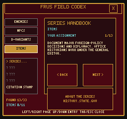
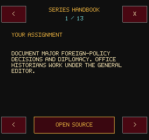
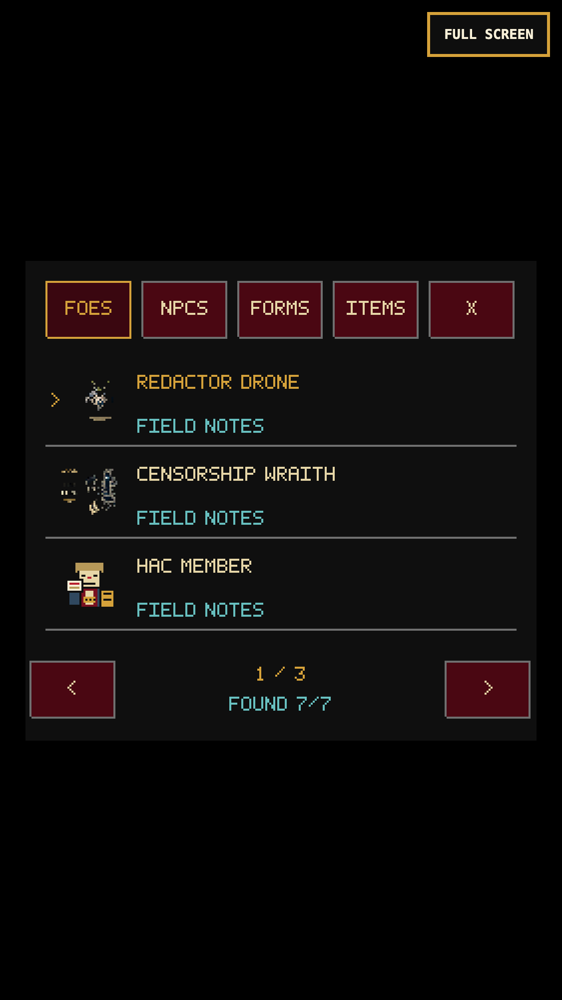
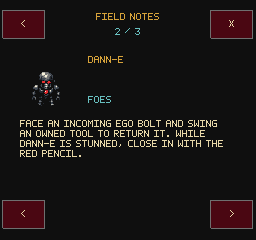
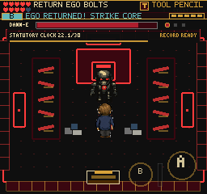
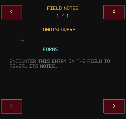
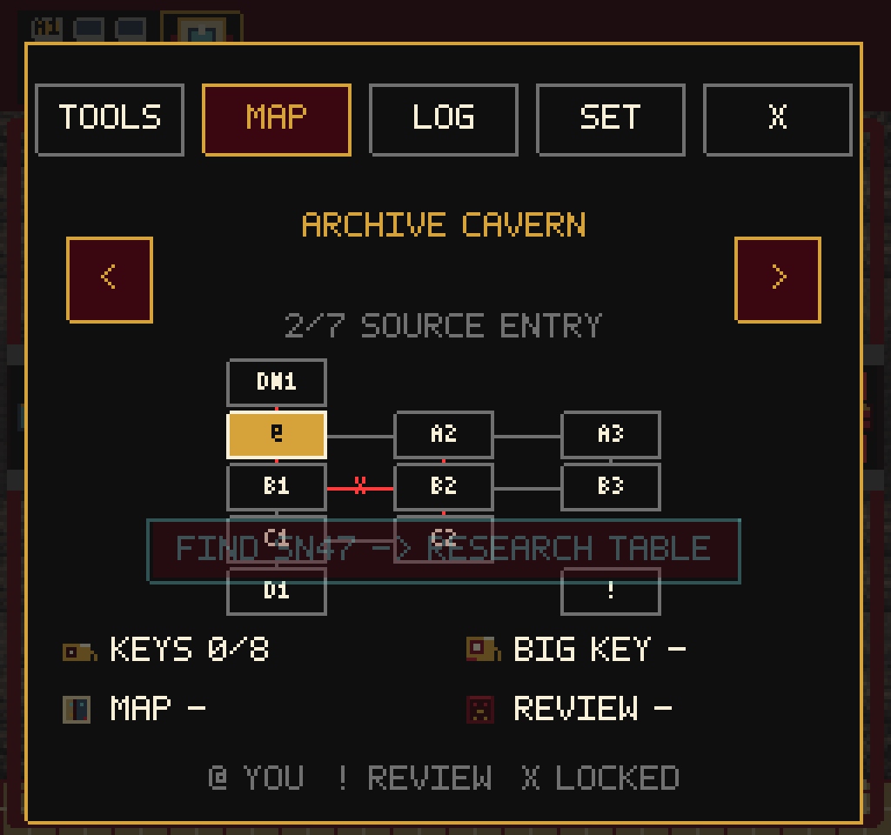
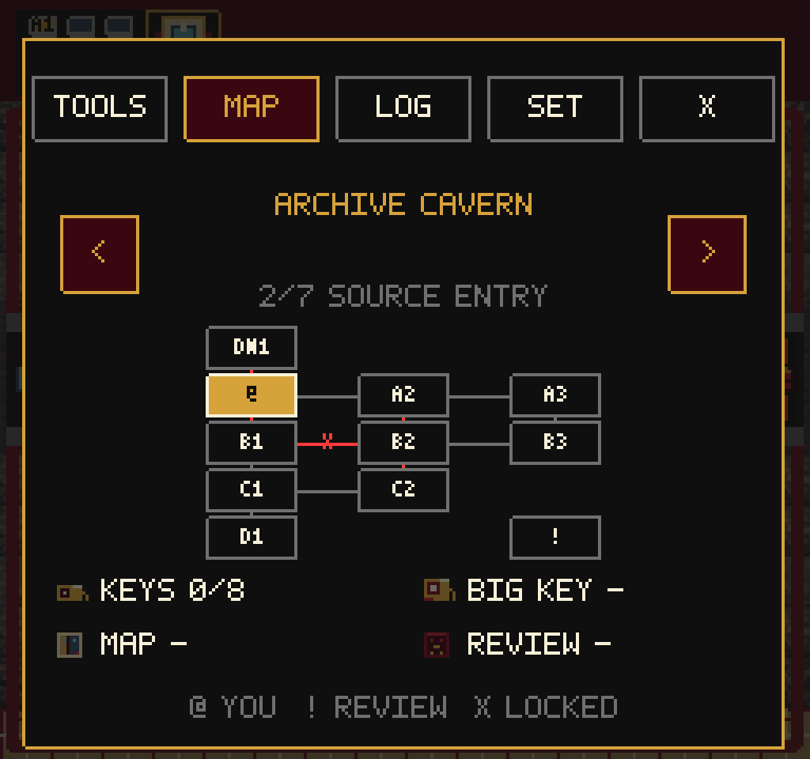

# Readable Field Guide

Local playtest pass, September 5, 2026. The guide is optional: no new mandatory
dialogues, quiz steps, rewards, or publication gates. The 256x240 canvas,
existing artwork, saved unlock IDs, inventory and human-review rules remain.

## Problems Found And Fixed

- The previous sidebar exposed only the first five entries to touch players.
  Small labels and 5-6px prose competed with art in the remaining column.
- The new guide uses four category tabs, three full-width entry rows, separate
  detail pages, native 8px text and non-overlapping targets at least 44x44 logical
  pixels. Page buttons reach every entry, including a short final page.
- Locked-entry prose overflowed during fresh-save QA; it now wraps through the
  same paginator. Unknown entries do not reveal their names or instructions.
- Lore is preserved rather than truncated. Paragraph breaks become page breaks
  so field-variant counters and Black Vault final-review advice stay distinct.
  Variant notes use the existing enemy configuration's actual counter method.
- The Series Handbook retains all 13 existing sections and its exact
  [official source](https://history.state.gov/historicaldocuments/frus1989-92v31/abouttheseries).
  The source button remains separate from page navigation.
- Native character frames remain 1x in detail views. Larger portraits use
  nearest filtering and reciprocal reductions, rather than the old arbitrary
  small-sprite cap. No source assets were edited or added.
- Fast repeated keyboard navigation was swallowed by the 110ms movement latch.
  Fresh non-repeat direction presses now produce independent menu edges;
  held movement, its short-tap nudge, action timing and touch input are unchanged.
  Swallow/reset still discards queued navigation.
- A screenshot exposed a pre-existing Archive toast over paused map nodes.
  Pause chrome now draws above transient feedback and cutscene chrome.
- Closing a standalone Codex debug route starts Title instead of a blank scene.
  Normal return restores the original gameplay snapshot without rolling back
  earned progress. `codexView` is a transient QA readout, not a save field.

## Verification

- `npm test`: 164 files / 1,053 tests pass. New coverage includes target geometry,
  full entry reachability, complete lore/handbook text, locked-page wrapping,
  field/final-review counter separation, rapid arrow/WASD menu taps, input
  swallowing, and pause layering.
- `npm run build`: TypeScript passes; 226 modules, 2,712.84 KB main JS versus
  2,712.59 KB at the preceding commit. Existing large-chunk warning only.
- Fresh desktop Chromium: all 33 entries, 45 detail pages, 20 locked entries;
  no text overlap or off-canvas text. Six rapid Down taps reach StateChat, Enter
  opens it, X goes back and Escape returns to the room. Official-source opening,
  direct-route close and exclusion of guide time from play time pass.
- Chromium touch, 375x667 / DPR 3: all 33 entries and 51 detail pages, all source
  sections, list/back/next/close controls and official-source navigation pass.
  This exhaustive art pass sets only codex unlock IDs for QA; it does not claim
  those entries were earned in a new playthrough.
- Desktop and touch combat: continue previously earned pre-boss save data,
  physically approach the core, begin review, open the guide during a warning,
  and read the counter advice. Over 2.2 seconds, boss telegraph, projectiles,
  position, HP, statutory clock, player combat and play time remain unchanged.
  Closing adds no swing; the next deliberate X/B counter returns a real Ego
  bolt and changes boss HP from 180 to 152 on both inputs.
- Fourteen primary/expansion debug routes render and round-trip through map
  pause. Source/console checks report no page errors. Pause depth is checked
  against existing toast depth, in addition to screenshot inspection.
- The required game client opens the handbook and reaches page two with correct
  text state. Its direct WebGL-buffer capture is still black in both headless
  and headed Chromium; renderer snapshots and compositor screenshots supply
  the inspected visual evidence. This capture limitation is not a visual pass.

## Evidence

Detailed local evidence: `/private/tmp/frus-codex-desktop-final`,
`/private/tmp/frus-codex-mobile-final`, `/private/tmp/frus-codex-combat-desktop`,
`/private/tmp/frus-codex-combat-mobile`, `/private/tmp/frus-codex-scene-final`,
and `/private/tmp/frus-codex-required-client`.

## Replay And Limits

1. In a room, press Tab or open pause -> Settings -> Codex.
2. Choose a category and page past the first three entries. Open an entry;
   use arrows for pages, X/B or the top-left arrow for the list, Escape/Tab or
   the top-right X to return to play. Keyboard Left/Right selects a category;
   Up/Down selects an entry and Enter opens it.
3. Items -> Series Handbook reaches the source-linked sections and source link.
4. During final review, read DANN-E's counter note, close, then deliberately
   face and return a bolt. The guide must not consume a combat warning window.

Initial QA exposed the locked-text and rapid-navigation defects; they were
fixed and replayed. One desktop attempt clicked a touch-only Start coordinate;
the corrected test uses the desktop M/Tab bindings. Existing guide copy is still
English-only and older enemy art still varies in readability. No real iPhone
Safari, locked-60 performance, new uninterrupted whole-game completion, public
deployment or full-goal completion is claimed. Next priorities are a fresh-run
pacing review, remaining enemy-art consistency, and real-device playtesting.
