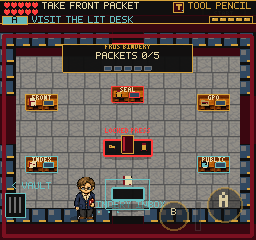

# Finale Discovery Audit

September 9, 2026. Local preview only; no public deployment.

## Earned Combat

Used the Editor/Proof chapter's earned Black Vault save, with no tools, HP,
clear flags or documents injected. Simulated touch completed Colossus, Swarm
and Cloud in 56.97 seconds of the measured counter loop (not total page-load
or introduction time): six counter cycles, six fresh core hits, zero retries.
The run also exercised skippable boasts, frozen clock/player during boasts,
pause during core exposure, satellite dispersal, three Cloud warning lanes,
bindery entry and Continue. No browser errors. Evidence:
`/private/tmp/frus-boss-discovery-0909/`.

This is a scripted timing-aware player, not a novice. It proves the loop can be
played through touch without cheating, not that the timing is obvious unaided.
The core follow-up and Cloud repositioning provide more action and consequence
than the earlier filing sequence. Secret Ascendant and physical iPhone behavior
were not exercised here.

## Publication

The earned boss save completed five bindery deliveries, index correction,
human standards certification, the binding press, publication and Continue.
Document points rose from 201 to 241, documents were preserved, and publication
and completion stats survived reload. The record correctly reports the deadline
as met for this run. Evidence: `/private/tmp/frus-finale-discovery-0909/`.

The old note describing 38 checks overstated the live interaction count: those
checks are grouped under five packets, not presented as 38 separate prompts.
Do not remove source/standards requirements on the basis of that old note.

## Readability Fix

At entry, `< VAULT` at (30,204) ran into the centered BINDERY INBOX label at
(128,205). Moved the return label above its stair at (12,182), preserving its
font size. Named both labels so the browser audit checks their actual rendered
bounds do not intersect. No collision, input, reward or save changes.

Post-change touch replay again published and resumed without browser errors:
`/private/tmp/frus-finale-labels-after-0909/`. The installed keyboard client
resumed and picked up the front packet at
`/private/tmp/frus-finale-client-after-0909/`. Both native captures were inspected.
Build passes (255 modules, main JS 2,802.69 KB, existing chunk warning); all
195 test files / 1,457 tests pass.

## Remaining Bar

Completion by a scripted player is not proof of the full fun objective. An
unaided player still needs to demonstrate understanding of the first counter,
the move from returned bolt to core strike, and the publication payoff.
Prioritize that pacing/comprehension test before adding another chapter or
another filing system. No locked-60-fps or real-device claim is made here.
