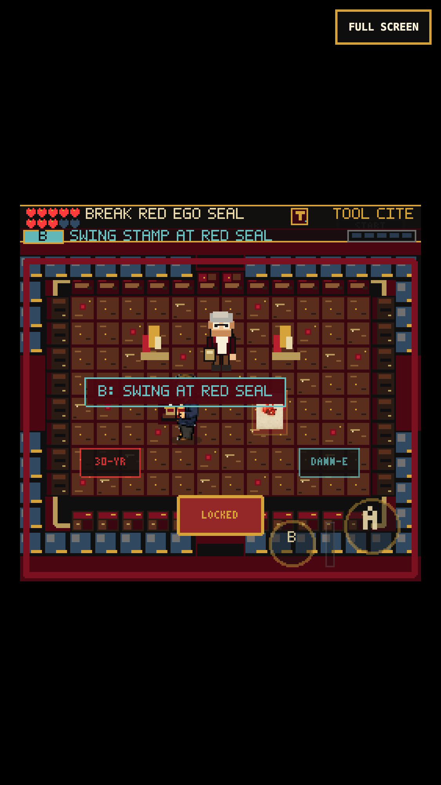
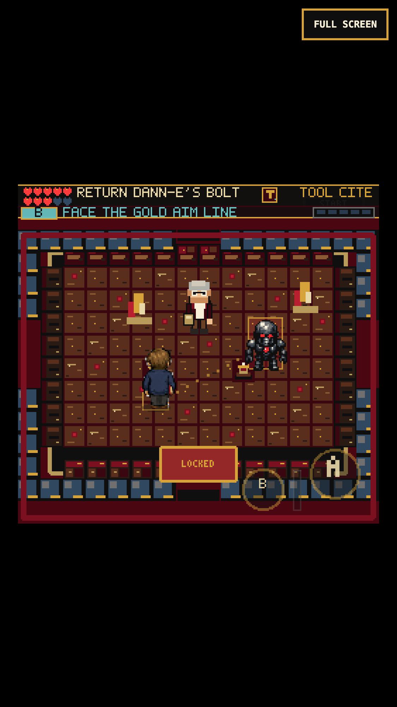
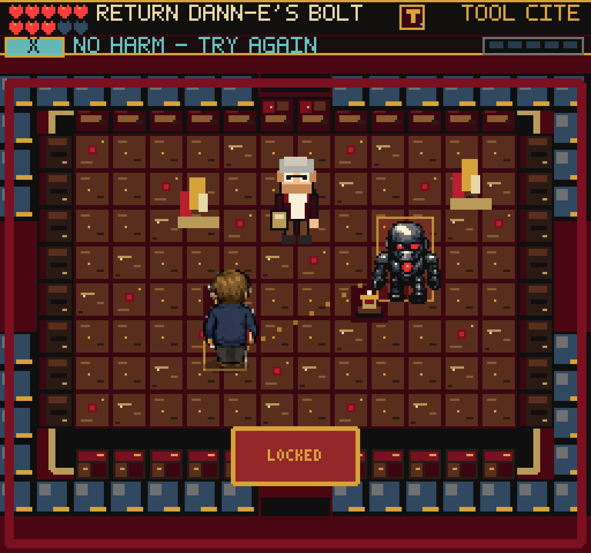
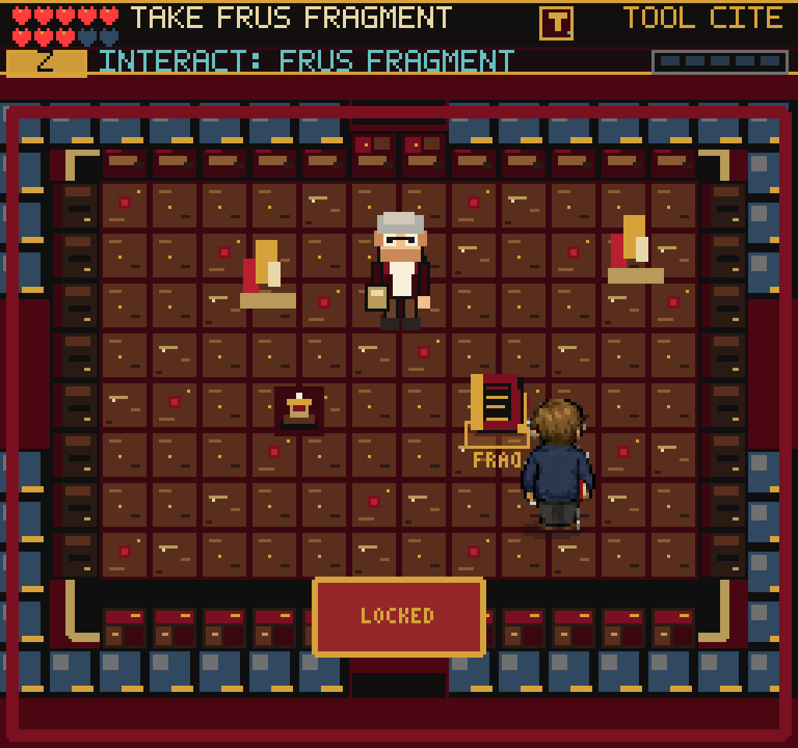

# A live first counter

## Why this changed

The first Citation Stamp lesson previously awarded counter training when the
player hit a stationary seal. That demonstrated swinging, but not the timing
or facing needed to return DANN-E's moving attacks later in the game.

The Guide now presents one harmless DANN-E projection. A gold aim line locks
onto the player's position for 900 ms, followed by a slow, non-homing Ego bolt
at 52 game pixels per second. An active, owned Citation Stamp swing returns it.
Only the returned bolt striking its source breaks the seal and reveals the
Front Matter Fragment. This gives the first dungeon tool a physical payoff.

- One bolt at a time. Misses restart after 800 ms and never damage reliability.
- Returns use the final boss's existing motion integration and return speed.
- Menus freeze charge time, bolt motion, projection animation and the weapon
  clock. Closing pause does not add a swing.
- The existing training flag, stamp reward, fragment reward, save format and
  Archive gate remain. The practice projection awards no boss credit or points.
- A completed legacy lesson is still completed; existing fragments are honored.
- English, Spanish and French HUD objectives/counter cues remain short. Other
  Guide dialogue keeps its existing English copy.
- Removed decorative threat plaques and the success banner over the hero.
  Pickup and exit cues now use a floor highlight and the existing HUD. The
  optional colleague still has normal dialogue.
- Existing DANN-E and bolt textures have missing-texture fallbacks. No new art,
  dependency, camera, rendering scale, combat balance or historical claim.

## Verification (2026-09-05)

`npm test`: **166 files / 1,072 tests pass**. New deterministic tests cover
charging/locked aim, moving bolts, active-overlap requirement, parry priority
over same-frame contact, return impact, harmless retry, timeout, pause, delayed
frames, the actual scene handler's ownership check and once-only saved credit.

`npm run build`: passes, **227 modules**, main JS **2,716.74 KB**, up 3.90 KB
uncompressed from the preceding build. The pre-existing large-chunk warning
remains.

Fresh browser runs, with no injected save or scene override:

1. Warning -> Title -> Compiler -> Office introduction, memo, inbox and stamp.
2. Guide -> acquire the Citation Stamp -> allow a live bolt to miss.
3. Confirm reliability remains 80 and no training/reward flag is granted.
4. Pause a second incoming bolt for 2.2 seconds; its readout remains identical.
5. Close pause without a swing; confirm A alone does not complete the lesson.
6. Face the bolt and swing X, or touch B, to return it and reveal the fragment.
7. Collect the fragment once, reload, Continue, and enter the Archive.

Both desktop (1024x960) and touch emulation (375x667, DPR 3) pass without page or
console errors. The touch run also holds the D-pad north and B simultaneously:
two pointer owners, upward direction and Citation Stamp windup remain active.

Fourteen debug routes render nonblank and round-trip through the paused map:
Title, CharacterCreate, Office, Guide, Archive, Network, ReferralVault,
SilentRead, CherryBlossomGarden, BlackVaultLair, SenateHearingChamber,
NaraStacks, HiddenReadingRoom and EmbassyCableRoom.

A separate earned-save Black Vault fixture verifies that the real boss still
freezes during the field guide and takes 180 -> 152 HP from a returned bolt.
This fixture is not a new full-game completion.

## Replay

Start the existing preview, then use an already installed Playwright runtime:

```sh
PLAYWRIGHT_MODULE=/absolute/path/to/playwright/index.mjs \
CHROMIUM_EXECUTABLE=/absolute/path/to/chromium \
FRUS_QA_URL=http://127.0.0.1:5195/ \
node tools/qa-guide-counter.mjs
```

Add `--mobile` for the touch run. `FRUS_QA_OUT` overrides the output directory.
The replay uses real keyboard/touch events; game state is read only. It writes
screenshots, result JSON and genuinely earned browser storage. No Playwright
package is added to this repository.

`render_game_to_text()` now includes a transient `guideCounter` object in both
concise and full modes: phase, remaining milliseconds, locked target, bolt
position/returned status, attempts and `harmless`. It is not saved
and is cleared when the lesson or scene ends.

## Visual evidence

| Before: static seal | After: telegraphed bolt |
| --- | --- |
|  |  |

| Desktop warning | Unobscured reward |
| --- | --- |
|  |  |

The required web-game client ran in both headless and headed Chromium. Its
direct WebGL-buffer PNG remained black, although state output was valid.
Screenshots above use inspected compositor captures; native renderer snapshots
also rendered correctly. Do not change the game renderer to accommodate that
capture-path limitation.

## Remaining work

- This is an opening skill/payoff improvement, not proof that the whole game is
  finished or consistently fun. The next fresh pacing pass must use the current
  First Footnote decision and later batch-routing rules; the old replay tried
  to walk while that decision was open, which is not a gameplay softlock.
- Mixed older colleague/hero art remains visible. This change reuses existing
  assets rather than claiming an art overhaul.
- Touch emulation is not actual iPhone Safari or sustained-device FPS testing.
- Local branch/preview only; no public deployment was made in this pass.
