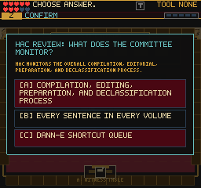
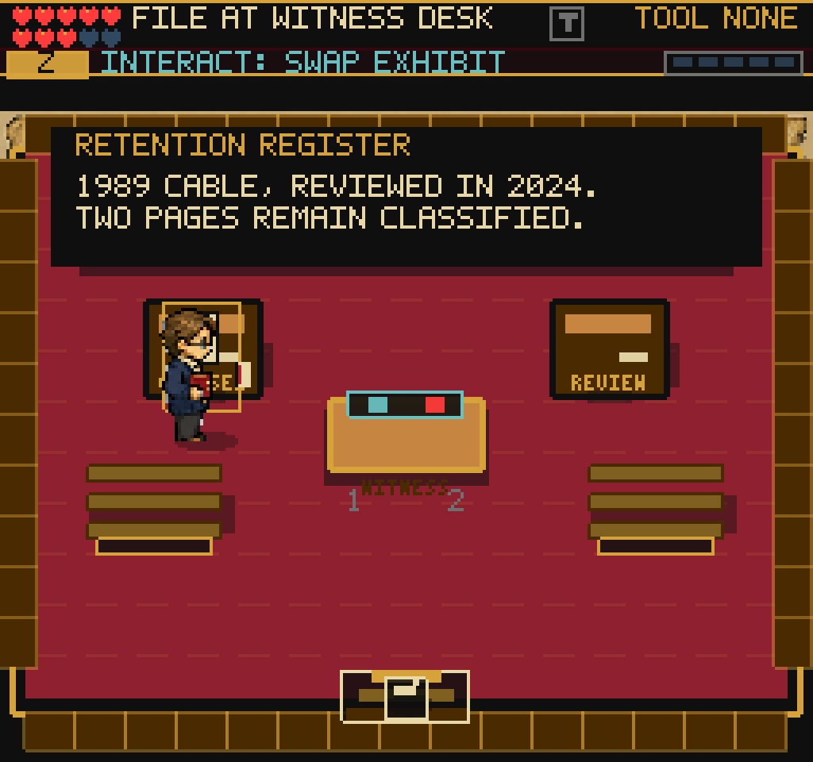
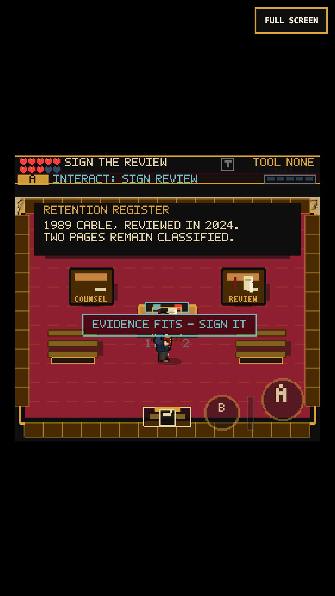
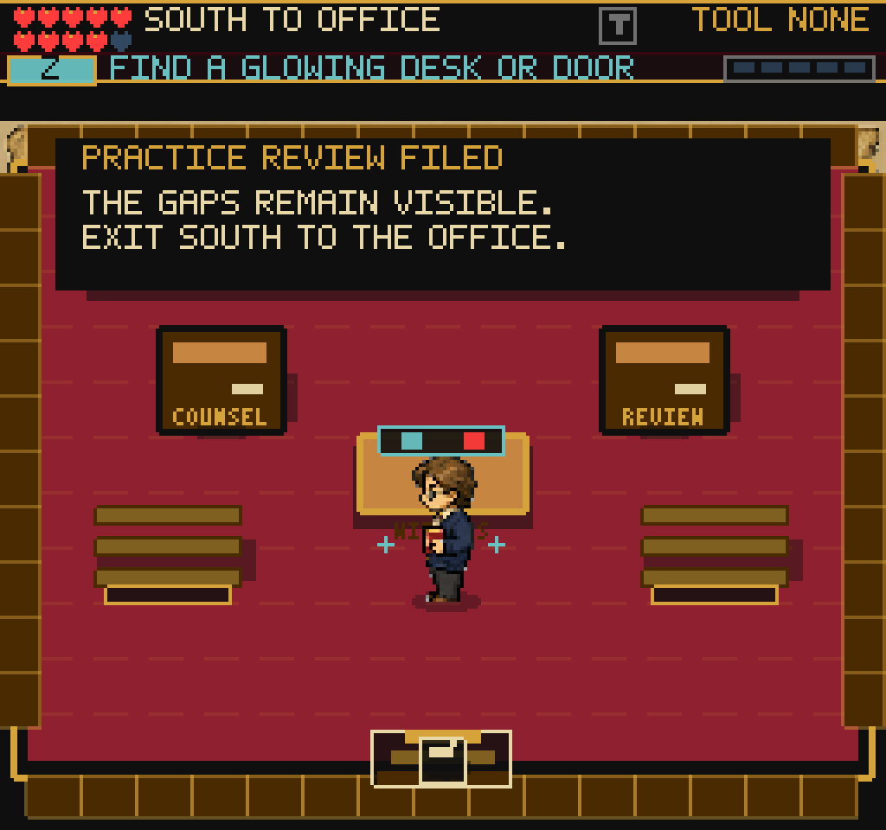

# A physical evidence review

## Why this changed

The previous Senate room required 17 confirmations while the player stood at
(128,169). Five quiz questions and their follow-up dialogue covered the room.
The optional Treaty Fragment II reward now comes from comparing two desks,
carrying an exhibit to the witness desk, placing it, and signing it separately.
Two signed exhibits complete the review; a final interaction claims the reward.
The existing archive/combat/publication route and fragment prerequisites remain.

## Source and fiction boundary

- [About the Series, START I, 1989-1991](https://history.state.gov/historicaldocuments/frus1989-92v31/abouttheseries): wholly withheld documents retain their chronological place, with a heading, source note, and page count. The second exhibit preserves that entry instead of silently skipping it.
- [HAC authority and responsibilities](https://history.state.gov/about/hac/intro): the committee reviews representative samples of Department records still classified after 30 years. The first exhibit distinguishes a retained classified record from a list of fully released records.

The records, file number, dates, and exercise are fictional. This is not a
reenactment of a Senate hearing, an actual HAC meeting or random sample, or a
document-clearance decision. HAC is not a Senate committee. The on-screen
heading identifies a practice review; the production board explains the limit.
The five older HAC prompts remain available to the separate legacy Capitol
packet system, not auto-claimed as five new completed lessons here.

## Gameplay and state

1. Compare the Retention Register and Release List. Carry the register.
2. Place it at the witness desk, then press the primary action again to sign.
3. Compare the Shortened List and Withholding Entry. Carry the latter.
4. Place and sign it, then separately collect Treaty Fragment II.
5. Exit south to the same Office doorway. The return remains available mid-task.

A rejected, unfiled practice exhibit gives a short corrective toast. It does
not damage reliability or become an undisclosed deletion. Final signing grants
the existing +6 reliability once; the fragment also remains one-time.
Carried/placed papers are visible objects, two seals mark progress, and the
witness desk has a matching collision body. The evidence panel occupies the
nonwalkable dais. Its two lines use the existing bitmap text factory at 8px.
Floating interaction labels are suppressed in this room so they cannot cover
evidence. The HUD shows short Take/Swap/File/Sign actions. Empty pickup zones
are removed after completion/collection, including after Continue.

`senateEvidenceStep`, `senateEvidenceCarried` (0/1/2), and
`senateEvidencePlaced` persist in existing numeric `sceneProgress` fields.
The canonical completion flag stays `senateHacReviewComplete`; legacy completed
saves can claim a missing fragment without replaying or repeating the bonus.
Legacy quiz step 3 or later retains sampling credit. Another chapter's
`heldItem`, inventory, points, and save schema are not replaced by this carry
state. DH1 is a visited puzzle room. Both concise and full
`render_game_to_text()` expose `hearingReview` while in this room.

## Verification, 2026-09-05

- All 153 Vitest files / 969 tests pass, including pure transitions, wrong samples, separate signatures, serialization, legacy rewards, real handler calls, and removal of empty pickup targets. The prior source-string-only legacy reward test is replaced by a behavioral handler test.
- TypeScript and production build pass: 220 modules, 2,708.81 KB main JS versus 2,703.54 KB at the previous checkpoint (+5.27 KB uncompressed). The existing large-chunk warning remains. No dependency or runtime art files were added.
- Fresh Office onboarding was played with real input, not granted items: JR -> memo -> inbox -> stamp -> key -> north-right Senate doorway. Desktop Chromium (1024x960) and touch Chromium (375x667, DPR 3) then completed both wrong/correct exhibit loops, carrying, filing, signatures, fragment, pause/map, and the return to Office.
- Continue worked while carrying, after placing but before signing, after final signing but before claiming, and after collection. Leaving for Office while carrying, reloading there, and walking back preserved the exhibit. The five Office points stayed five; reliability stayed 80 through practice mistakes and rose to 86 only on completion. One fragment remained after repeated attempts/reloads. No blocking choice or dialogue appeared.
- Both evidence text objects stayed within x=16..240/y=40..84; the duplicate floating prompt stayed hidden. Screenshots were opened and inspected, including phone evidence/signature views and the cleared desk after Continue.
- All 14 checked routes rendered nonblank without page/console errors: Title, CharacterCreate, Office, Guide, Archive, Network, ReferralVault, SilentRead, Garden, BlackVault, Senate, NARA Stacks, HiddenReadingRoom, Embassy.

Evidence: `/private/tmp/frus-hearing-earned-desktop/` and
`/private/tmp/frus-hearing-earned-mobile/` contain captures, readouts, logs, and
final storage snapshots. `/private/tmp/frus-hearing-before/` contains the old
17-confirmation baseline. `/private/tmp/frus-hearing-scene-smoke/` records the
14-route check. The required skill client was also run in headed/headless
modes and exercised the witness hint; its direct WebGL-buffer screenshots
were black in both modes, so compositor captures and in-frame renderer
snapshots are the visual evidence, not those black captures.

Two test-route errors were corrected without loosening gameplay: a waypoint
crossed an Office desk, and a bare Senate debug start had skipped the Office
key needed to re-enter through its normal doorway. The final runs earned the
key from a fresh Office and used the clear north corridor. Earlier failed
attempts remain under `/private/tmp/frus-hearing-after-*` and
`/private/tmp/frus-hearing-final-*`; they are not passing evidence.

## Screenshots

| Before: stationary quiz | After: read an actual exhibit |
| --- | --- |
|  |  |

## Limits and next playtest

This is a local checkpoint, not a public deployment or a new full-game
completion. Touch emulation is not physical iPhone Safari certification.
The Office's existing first-task gate remains intact. Other optional rooms
still have crowded labels; the NARA stacks are the clearest next readability
target. Transition performance, real-device audio/resume, and pause-time
accounting remain broader follow-ups. This small puzzle improves the optional
exploration loop; it does not prove the whole game's fun or completion bar.
