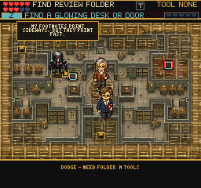
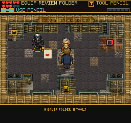

# NARA Walkable Floor Pilot

The optional `GameplayMapScene?map=nara_stacks` formerly combined a detailed
full-map image with translucent generated floor tiles. Hiding the extra grid
alone did not meaningfully separate paths from decorative details.

The pilot draws opaque 16-pixel archive tiles only in completely clear cells.
It retains a full tile of border art and leaves cells touching collision
objects, including a one-pixel silhouette margin, transparent. Original map
art remains underneath. Doors, features, pickups, actors and collision data are
unchanged. Other maps retain their existing rendering.

Tiles use the existing `archiveDungeonNative` registry entry, packed margin and
spacing, and GID conversion. Zero-based floor frames are 0, 1, 2 and 5; accents
are sparse and deterministic. Missing textures or a failed layer build use the
previous renderer. The tilemap is destroyed at scene shutdown.

## Visual Evidence

Before:

After:

Actor positions differ between captures. These are native renderer screenshots,
not edited mockups. Playwright verified physical aisle navigation and a resisted
Pencil hit on Mark I: unchanged enemy HP, readable Folder hint and explore mode.
That focused encounter used the existing debug tool grants, not earned progress.

Fourteen focused tests and production build pass. Browser readiness checks pass
for missing, unequipped and equipped tools. No page errors were observed.

## Remaining Work

### Encounter Follow-Up

The full two-wave keyboard replay now lives in `tools/qa-nara-waves.mjs`.
It grants starting tools through the existing debug URL, defeats Mark I with
the Folder, equips the Stamp through the real pause menu, clears the Swarm,
checks documentary invariants, and interacts with the freight elevator.

That test exposed an unreachable elevator activation zone embedded in its
solid. The zone now sits on the walkable front edge, and the authored arrival
is on clear floor beside it. Collision walls and destination are unchanged.
`naraElevator.test.ts` reads the actual Tiled data and verifies a clear approach,
arrival and route. The latest replay reached the world map at 56 reliability
with 8 points and both enemies cleared. Evidence: `/private/tmp/frus-nara-waves-final/`.
This remains a debug-tool encounter test, not an earned progression playthrough.

### Preparation and Retreat

The region-select preview now names missing Folder/Stamp tools before entering
the optional NARA encounter. It does not lock exploration behind equipment.
During combat the return elevator remains usable, while forward vault routes,
NPC interactions and rewards keep their existing encounter lock.

`tools/qa-nara-retreat.mjs` starts with an empty browser profile and no debug
tool grants. It selects Bonn, checks the preparation text, enters NARA, walks
to the elevator, returns and re-enters. It asserts unchanged inventory, points
and stamps, and an active uncleared patrol on return. Set `PLAYWRIGHT_MODULE`
and `CHROMIUM_EXECUTABLE` for a non-local Playwright installation;
`FRUS_QA_URL` and `FRUS_QA_OUT` optionally choose server and evidence directory.
Native captures from the passing run: `/private/tmp/frus-nara-retreat/`.
This proves unarmed retreat, not the full earned-tool route.

Named enemy rewards are now claimed once per room/enemy in saved scene progress.
Enemy recreation cannot multiply document points; new runs reset the claims.
Enemy and actual save-storage tests cover retry and reload behavior. A complete
two-wave input replay still awards eight points and opens the exit. Browser
partial-wave retreat remains a follow-up; individual enemies currently respawn
when returning to an uncleared encounter.

### Scope Limits

The source map's tiny border labels and some decorative wall details remain.
This is a visual pilot, not a replacement for reviewing optional-room layout,
unaided player comprehension or physical-device performance. Compare room
navigation with the main quest before applying this approach to other maps.
