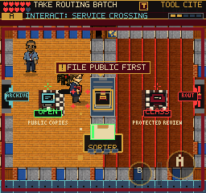
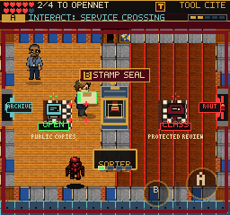

# Network Crossing Clarity

## Observed Problem

The service crossing displayed a swing-button badge and STAMP SEAL before the
first public packet was filed. At that stage, even a correct Citation Stamp
hit cannot open it. This advertised an unavailable action and only explained
the missing prerequisite after the player tried it.

The nearby prompt now reads `! FILE PUBLIC FIRST` while sealed. After the
public packet is filed, it immediately changes to the platform's secondary
action badge and `STAMP SEAL`. The existing gold readiness lamp is unchanged.
An open crossing has no seal prompt. Physical collision, tool ownership checks,
active hit windows, rewards and save fields are unchanged.

## Verification

The initial simulated-touch run started from the earned Archive save and
reached the Referral Vault. It checked packet handoff, wrong-network recovery,
Marcus's optional help, crossing pause/Continue, review batch handoff,
withholding-entry correction, unfiled Continue and the Clearance Token.
Evidence: `/private/tmp/frus-network-discovery-0909/mobile/`.

The browser audit now explicitly waits for and captures both the sealed and
ready prompts instead of inferring readiness from a successful later swing.
Post-change evidence: `/private/tmp/frus-network-prompts-0909/mobile/`.
The installed keyboard browser client also approached the sealed crossing:
`/private/tmp/frus-network-prompt-client-0909/`. Native screenshots inspected.

Build passes: 255 modules, main JS 2,802.58 KB; existing chunk-size warning.
All 195 test files and 1,455 tests pass. The source-level prompt test is a
structural guard; the browser assertions and inspected screenshots verify the
actual visible states.

The post-change full touch replay reached Referral with the Clearance Token,
preserved unfiled-review progress across Continue, and reported no browser
errors. This run used a 375x667 simulated touch viewport, not a physical iPhone.

## Scope

This corrects one misleading affordance; it does not prove unaided players
understand the complete routing exercise. No real-device performance claim or
deployment is implied. The room's rules are a fictional exercise, not operational
instructions for handling government information.
