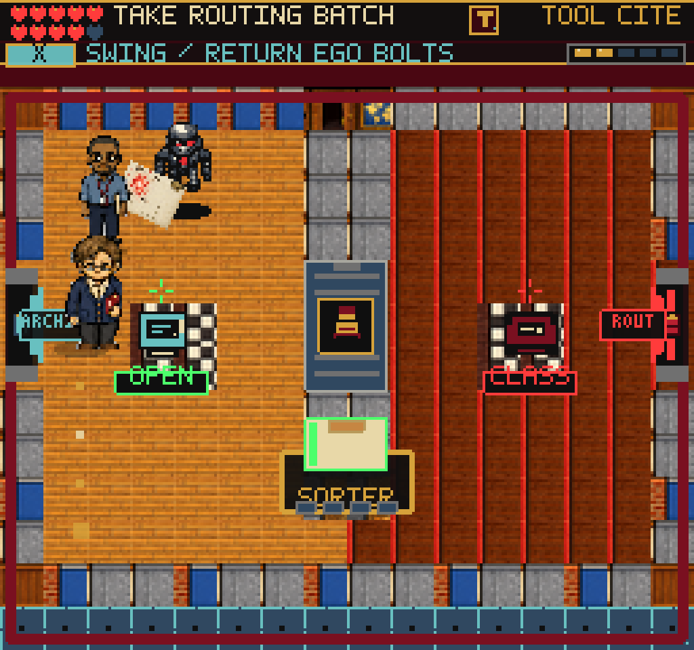
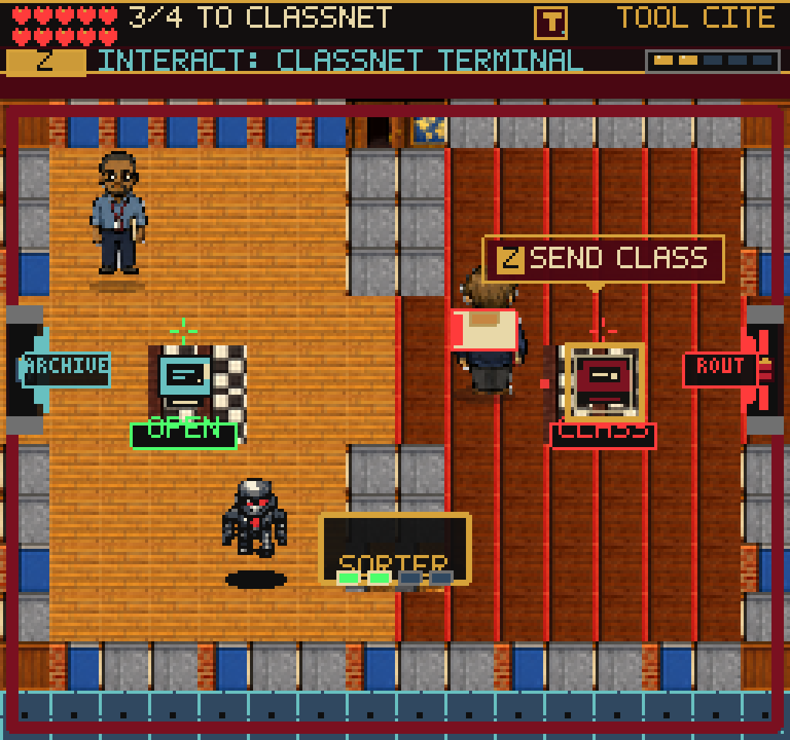
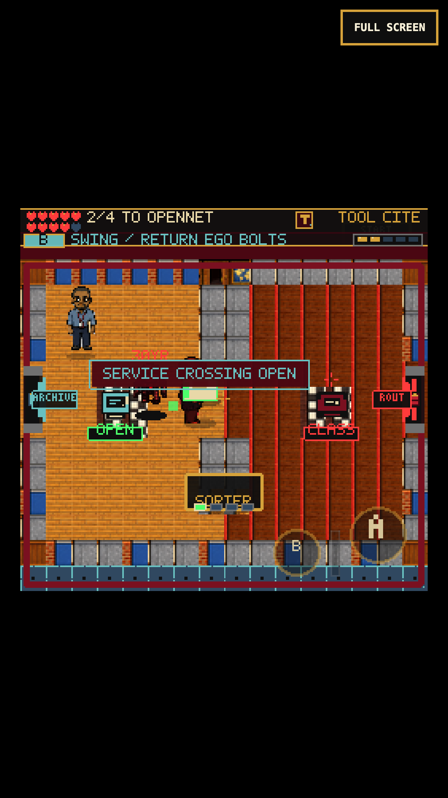

# Network Stamp Crossing

## Why this room changed

N1 previously displayed two animated wall figures without collision. Its
public/protected routing loop was already batched, but the room offered no
physical discovery between the two terminals. The figures are replaced by a
real divider, an optional stamp seal, and a permanently available lower route.

The first public packet lights the seal. A Citation Stamp swing opens a direct
crossing; touching it, pressing the interaction button, using the wrong tool,
or swinging before the packet is filed does not. A short toast explains the
prerequisite without adding a dialog or another required review decision.

This opens a walking route, not a release authorization. All four routing
packets and all three vault dockets still require the existing player actions.
The withholding ledger, Clearance Token, review flags, points, and document
records are unchanged. The lower route remains available if the player never
discovers the crossing. Completion also removes the seal for old cleared saves.

## Implementation

- `src/game/networkCrossing.ts`: typed access check, geometry, route waypoint,
  and legacy-spawn correction using the actual 16x8 player feet.
- `src/game/networkN1Tilemap.ts`: matching solid divider tiles, three-tile-high
  crossing, and two-tile-high lower passage. The opening uses the surrounding
  floor textures so it does not look like a wall after the seal breaks.
- `src/scenes/NetworkScene.ts`: active-frame stamp interaction, persistent
  `sceneProgress.networkStampCrossingOpen`, nearby X/B cue, lamp, sound, and
  immediate collision removal. The existing texture fallback remains playable.
  Route dots now follow a usable crossing or the lower passage and sit beneath
  characters instead of covering them. The patrol goes around the divider.
- `DanneLurker`: optional room-solid callback absorbs bolts at the divider.
  Other scenes keep their current behavior when no callback is supplied.

No new game assets, dependencies, save schema, chapter rewards, or release rules.
`render_game_to_text()` exposes the flag through `sceneProgress` and the current
sealed/ready/open status through the visible entity list.

## Verification

- Full suite: 177 files, 1,222 tests. Build: 238 modules; main JavaScript
  2,755.20 KB (existing large-chunk warning). Focused tests cover prerequisites,
  wrong/unowned tools, idempotence, save round-trip, map/collision agreement,
  route waypoints, old spawn overlap, and bolts stopping at room solids.
- `tools/qa-network-ledger.mjs --crossing` uses an earned Archive completion
  save, then real movement and action controls. It tries the sealed crossing,
  files the first packet, opens the seal, checks that records/rewards are
  unchanged, reloads, crosses, finishes N1 and N2, and enters Referral Vault.
  The same replay runs with `--mobile` at 375x667 / DPR 3 using actual touch
  events. Pause/close is checked beside the gate without unlocking it.
- Running without `--crossing` still completes both rooms by the lower route.
- Browser restoration fixtures change only the saved player position to test
  old divider/edge overlaps and a safe floor position. These are synthetic
  compatibility fixtures, not claimed as earned gameplay. A deliberately
  blocked native-tileset request also verifies fallback collision and rendering.
- Direct WebGL-buffer captures from the required game client remain black in
  headless and headed Chromium. Native-renderer and compositor screenshots were
  inspected; those show the actual room. No normal-play page/console errors.
  The deliberate missing-texture case naturally has a failed asset request.

Local evidence: `/private/tmp/frus-network-crossing-verified-desktop`,
`/private/tmp/frus-network-crossing-verified-touch`,
`/private/tmp/frus-network-crossing-detour`, and
`/private/tmp/frus-network-crossing-safety`.

## Limits / Next

This is an original tool-gated spatial reward, not a claim that the whole game
has reached the adventure quality goal. The middle chapters still lean on
terminal/desk work. Next: a short exploration room with an obtainable clue and
a meaningful return route, while keeping the player's review decisions intact.
Actual iPhone Safari and uninterrupted full-game pacing remain unverified.
No public deployment is included in this change.
