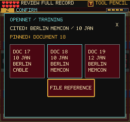
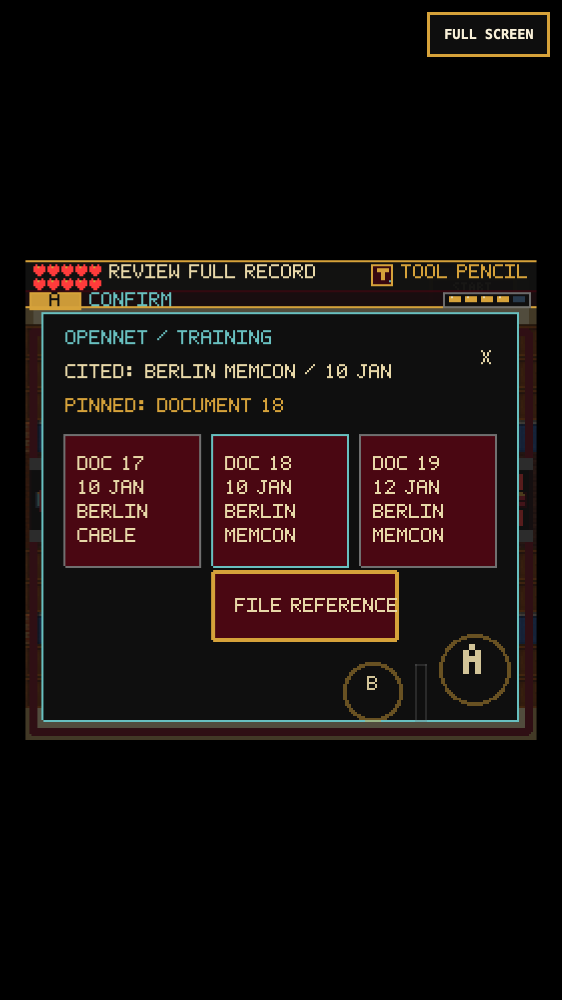

# OpenNet Cross-Reference Catalog

The OpenNet step previously verified its evidence-bound file on a second A
press, without asking the player to examine anything. It now opens a compact
three-document catalog when the carried Open Note is placed on its desk.

The cited record is a Berlin memorandum of conversation dated 10 January.
The catalog contains a same-date cable, the matching memorandum, and a
different-date memorandum. Pin a record, then explicitly file the reference.
Wrong matches give specific, non-punitive hints. Matching the topic alone is
not enough. The original separate approval stamp grants the unchanged reward.

These are fictional training records, not documents 17-19 in the START I
volume. The educational basis is the actual
[About the Series](https://history.state.gov/historicaldocuments/frus1989-92v31/abouttheseries):
annotation links readers to related documentary evidence, and editorial
methodology distinguishes conversation dates from drafting dates. No claim
is made that these invented practice records appear in that volume.

## Controls and State

- Directional input moves focus; A selects a card, then A on File submits.
- Mouse/touch select a card and use File Reference. B, Esc, or X closes.
- `sceneProgress.silentReadCrossReferenceDraft` stores 0 (none) or 1-3.
  Invalid values restore to none. Both wrong and correct unfiled drafts
  survive Continue. Opening, selecting, or cancelling grants nothing.
- Player, weapon and DANN-E stop during review. Closing consumes input.
- Existing verified/completed saves remain credited. No schema change,
  extra reward, tool requirement, room transition or automatic approval.
- Choice telemetry exposes the pinned document for browser QA. The HUD uses
  the existing localized record-review label instead of Choose Answer.

## Evidence

Final automated suite: 186 files / 1,347 tests. Final production build:
249 modules, main JS 2,785.42 KB (+4.20 KB); existing large-chunk warning.
Twenty-two added cases cover draft validation, matching, input/cancellation,
hidden controls, distinct selection/filing/stamping, pause and stale callbacks.

The first complete keyboard/mouse chapter replay reaches Black Vault with
the expected 87 earned points. It covers both incorrect matches, saved wrong
and correct drafts, cancellation, separate filing/stamping, subsequent proof
decisions, tool rewards and backtracking. It used the initial stacked layout.

The first touch replay exposed an actual bug: the stacked layout's File
button overlapped virtual B, so cancellation could file a correct draft.
The final side-by-side layout places filing above virtual A/B and entirely
outside the floating D-pad's left third. Regression tests check those bounds;
the replay now explicitly asserts cancel preserves routed/unfiled status.
Further visual inspection caught the edge of A's larger invisible hit zone;
the final regression checks entire A/B/Start/Select rectangles, not centers.
All actionable rectangles are at least 34 logical pixels in each dimension
(over 44 CSS pixels at the tested phone's scale).

The complete touch-safe chapter replay reaches Black Vault with 201 points,
98 reliability and no standards findings or browser errors. The keyboard
run ends at 201 points / 100 reliability. Both earn the same 87 points.
The D-pad/A/B-only replay pins the matching card, cancels without filing or
swinging, reopens it, and explicitly files without granting the stamp reward.
The final source change after these runs only centers the File label; the
installed client separately verifies that rendering. Fourteen scene/pause/map
smoke checks also pass before that label-only change.

The installed gameplay client verifies the final keyboard card selection.
Native/compositor screenshots show Document 18 pinned with status still
routed and 126 points, not approved. The long boot/idle wait incurs ordinary
DANN-E exposure (96 reliability); that is distinct from paused board input.
Its direct WebGL-buffer capture is black and is not used as visual evidence.

Replay: `tools/qa-proof-comparison.mjs`, optionally `--mobile`, with an earned
Editor save in `FRUS_QA_STORAGE`. Browser evidence is under
`/private/tmp/frus-catalog-keyboard-0908`, `frus-catalog-touch-0908` (failure),
`frus-catalog-touch-final-0908`, and `frus-catalog-client-final-0908`.

Final-layout evidence: `/private/tmp/frus-catalog-touch-safe-0908`,
`/private/tmp/frus-catalog-pad-safe-0908`, and
`/private/tmp/frus-catalog-client-centered-0908`. The focused virtual-control
replay is `tools/qa-cross-reference-touch.mjs`; use the earned
`pending-catalog-storage.json` produced by the full chapter replay.

## Scope

This replaces an empty check with an evidence-matching action; it does not
prove the whole adventure is fun. Other repeated binary review prompts,
whole-route pacing and real-iPhone Safari remain future work. No public
deployment is included.
