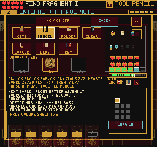
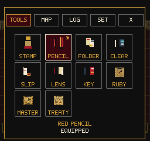
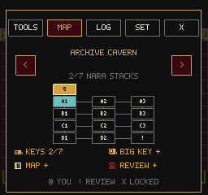
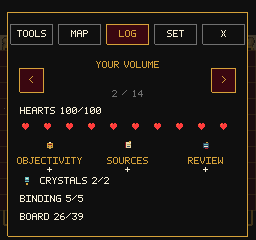
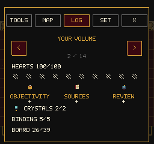
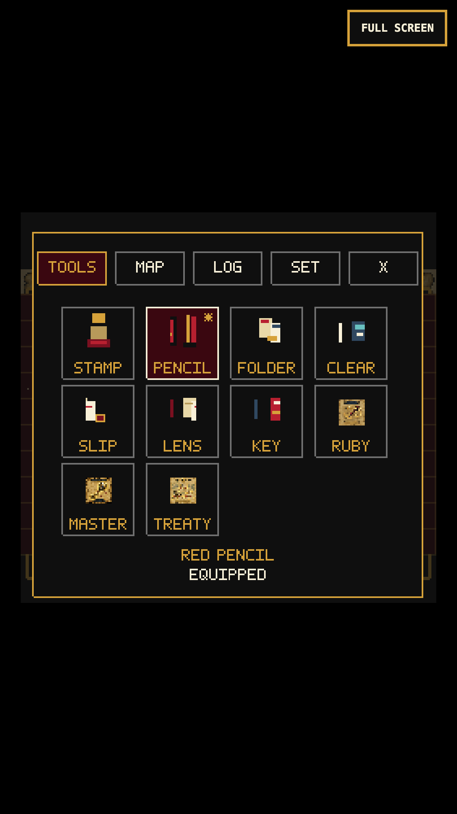

# Pause Menu: Tools, Map, Record, Settings

## Gameplay Change

The pause screen previously squeezed ten items, three pendants, crystals,
hearts, chapter keys, source notes, a shelf and options onto one page.
Several touch targets overlapped; hidden mobile action buttons could also
intercept taps. The result was difficult to use even with a complete inventory.

The replacement keeps the 256x240 canvas and existing saves:

- Tools: a four-column grid with separate 44x44 targets. First tap selects;
  a second tap equips or opens a special item's card. Keyboard/gamepad arrows
  follow the visible grid; confirm equips. Missing items cannot be granted.
- Map: a connected chapter diagram with a current-room marker, review rooms,
  lock crosses, and small-key/big-key/map/review status. Arrows browse all
  chapters. Secret-room visibility still follows the existing discovery gate.
- Log: the current gameplay objective first, followed by volume progress,
  the compilation task, its full source basis and URL, production phases,
  document equity counts, binding pieces, the hidden-edition bonus and shelf.
  Long entries paginate instead of shrinking or dropping text.
- Settings: separate contrast, language, sound and codex rows. EN/ES/FR menu
  labels remain available; untranslated existing gameplay prose stays English.

Up from the first tool row focuses the page tabs; left/right changes the
focused tab and down enters its page. Map/log left/right pages through content.
Esc/B/Tab, the X button and a tap outside close the menu. The closing input is
swallowed. The gameplay HUD and virtual action buttons are hidden while paused.
No menu state was added to the save schema. `render_game_to_text()` reports
the transient page, focus, selection and visible controls as `pauseMenu`.

## Evidence

| Before | Tools | Chapter Map |
| --- | --- | --- |
|  |  |  |

Validation on the local production preview:

- Full suite: 157 files, 996 tests pass. TypeScript and production build pass.
  Main JS is 2,704.03 KB, down from 2,711.70 KB; the existing chunk warning remains.
- Desktop keyboard/mouse and simulated 375x667 touch: select/equip, special
  cards, all chapter pages and record pages, language cycling, contrast,
  audio toggle, codex and return. Native text bounds were checked on each page.
- All seven process tools were equipped using actual pointer events. The
  Ruby Pen card was additionally checked with an explicitly seeded item fixture.
- Fresh and earned-save inventories tested. A missing tool remains missing;
  Continue preserves inventory, equipped tool and contrast. Frame-by-frame
  observation found no swing leaking through menu close.
- NARA touch combat regression: pause during a stamp windup, hold 2.2 seconds,
  resume and dodge, then take the existing stagger and defeat a drone with
  two registered tool hits. No console/page errors.
- Fourteen debug scenes render without page/console errors. Every exploratory
  scene opens its map and returns to play; title/character creation stay intact.

Detailed local evidence: `/private/tmp/frus-pause-complete-mobile`,
`/private/tmp/frus-pause-final-fresh-mobile`, `/private/tmp/frus-pause-complete-desktop`,
`/private/tmp/frus-pause-scene-smoke`, `/private/tmp/frus-pause-nara-combat-mobile`.
The standard web-game client also
ran. Its direct WebGL-buffer screenshot remains black in this environment;
the inspected compositor and in-frame renderer captures above are nonblank.

## Remaining Work

This is a focused menu/playability pass, not a fresh whole-game completion or
a physical-iPhone certification. The codex itself still needs a readability
pass. Completion-time accounting and a subsequent touch-resume issue are now
addressed in [Pause Time and Resume](PAUSE_TIME_AND_RESUME.md); other legacy
enemies need the same overlay-freeze audit as the NARA drones.
No public deployment was performed.
# Current-chapter objective check (2026-09-13)

An isolated Chrome context restored the cue-led opening's earned Archive save at
375x667/DPR3. The map showed room codes, locks, and dungeon status but no current
task. The active chapter now shows the live objective beneath its status rows;
other chapter pages (or an empty objective) retain the existing legend. The Log
continues to hold the full objective. Long map objectives wrap to two lines with
an ellipsis rather than shrinking the font or crossing the panel boundary.

Before/after native captures: `/private/tmp/frus-map-current/before.png` and
`/private/tmp/frus-map-current/map.png`. The after capture shows `PICK UP SOURCE
NOTE` without overlapping the status rows. No page or console errors were
captured. Tests cover wrapping, current-versus-other chapter behavior, and a
changed objective when returning to the current chapter. All 221 test files /
1,685 tests and the build pass; the existing bundle-size warning remains.
The standard browser client also ran in Archive and its native capture was
inspected. This is simulated-mobile layout evidence, not physical-device or
first-time-player comprehension proof. Room-code discoverability remains a
usability question for a fresh player; no map, gate, save, or progression data
was changed.
