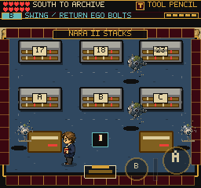

# Pause Time and Resume Gestures

## Current NARA / Field Guide Regression

On 2026-09-13, `tools/qa-codex-combat-pause.mjs` caught a live NARA drone stamp
during windup, waited 1.8 seconds in pause, opened the field guide through touch
settings, waited another 1.8 seconds, inspected its enemy entry, then closed and
moved away. All four enemy positions, HP and the remaining stamp warning were
identical throughout both stopped states. Closing preserved a live reaction
window, did not swing or hit the player, and the subsequent movement burst
avoided the stamp. Reliability stayed 80, but hit-state checks (not that meter
alone) establish the dodge. The script asserts invulnerability before close,
immediately after movement, and after the remaining active window.

The first harness falsely described a dodge because it checked only reliability:
the screenshot showed a hit flash after its movement went toward the marked
floor. Drone knockback does not itself debit reliability. The final harness
moves away from the target and explicitly catches hit/invulnerability state.
No runtime bug was reproduced and no gameplay code was changed.

Final native captures and readouts: `/private/tmp/frus-codex-combat-pause-final/`.
The field-guide list/detail and resumed-room captures were inspected at native
size; this one unlocked entry fit without overlap. No page/console errors.
This uses a debug-room fixture, keyboard setup/dodge, and touch menu controls at
375x667/DPR3, not a physical iPhone or a touch-only combat certification.

Source audit found no production imports/instantiations of BeeSwarm, NavyHillMice,
HacMember or FederalShutdown. Their old update methods are not live gameplay and
were left alone. Active drone, wraith, boss, lurker and GameplayMap combat paths
have pause guards; this new browser test verifies NARA/field-guide behavior only,
not all of those paths. Full codex-catalog readability is still not established.
The latest runtime verification remains 221 files / 1,685 tests plus a passing
build; this QA-only change additionally passed Node syntax checking.

## Player-Facing Fixes

Completion time now counts the playable adventure, including dialogue,
workflow decisions and the physical binding task. It excludes the title,
character creation, debug screens, pause menu, codex, final display, background
suspension and the wait for a resume gesture. Standing idle in a playable room
still counts. This is the completion statistic, not DANN-E's fictional clock.

The existing state/mode setters checkpoint elapsed time before switching modes
or rooms. Codex return checkpoints before restoring its transient parent fields.
Browser/native suspension is a runtime-only flag. Saving preserves accrued time;
Continue keeps the existing offline-time rebase. Old accrued totals and finished
scores are not rewritten. The save schema is unchanged.

Touch QA also reproduced a separate resume bug: dismissing the shield on
pointer-down allowed the following touch event to reach the pause menu's language
row. English silently became Spanish. The shield now stays through pointer-up,
consumes the associated touch/mouse/click events, and permits the next deliberate
gesture. Keyboard resume is immediate, but held-key repeats are consumed until
release. Cancellation does not resume; assistive click activation remains valid.
NARA's idle weapon hint now names the secondary counter button, matching its
actual swing input. Nearby documents still use the primary interaction button.

## Measured Evidence

Production Chromium, 1.2-second observations (including readout overhead):

| State | Before: added time | After: touch added time |
| --- | ---: | ---: |
| Title | 1,250 ms | 0 ms |
| Pause menu | 1,234 ms | 0 ms |
| Codex | 1,234 ms | 0 ms |
| Background event | 1,250 ms | 0 ms |
| Waiting for resume | 1,234 ms | 0 ms |
| Resume into an already-open pause menu | Not completed in baseline | 0 ms |
| Active room | 1,237 ms | 1,240 ms |
| Active room after resume | 1,227 ms | 1,229 ms |

The final 375x667/DPR-3 touch check also verifies language stays English, resume
does not swing, the next close tap works, and Continue adds only 449 ms of newly
active time, excluding background/load/entry-screen waiting. Console errors: zero.
The desktop sequence likewise added zero in stopped states and only 406 ms on
Continue. All fourteen scene routes render and exploratory rooms return from map
pause without console errors.

An additional earned-inventory fixture checks resuming directly over the weapon
button in NARA: every sampled phase stays idle for the resume tap; the next
deliberate tap reaches the active swing phase. This initially used A, which is
contextual interaction in that room, then correctly used B. That discrepancy
also exposed and prompted the corrected HUD hint. Fixture and phase samples:
`/private/tmp/frus-resume-equipped-mobile`.

The initial baseline script's second resume used a locator that retried after
pointer-down removed its target; it timed out. The completed checks use actual
press/release coordinates. Inspecting the first touch capture exposed the language
fall-through, which is now explicitly asserted rather than inferred from mode.

Tests: 158 files / 1,007 cases pass, including six new clock tests and five resume
gesture tests. TypeScript/build pass: 223 modules, 2,705.22 KB main JS; existing
large-chunk warning remains. Detailed local evidence is under
`/private/tmp/frus-playtime-before-desktop`,
`/private/tmp/frus-playtime-shield-desktop` and
`/private/tmp/frus-playtime-shield-mobile`.

## Limits and Next Work

### Demand-loaded Field Guide (2026-09-13)

Field-guide pause now starts in `init`, before portrait network requests.
`qa-codex-combat-pause.mjs --slow-portraits` delays requests two seconds and
checks the loading screen, frozen encounter, clean close and remaining dodge
window. `/private/tmp/frus-codex-slow-final/` passed; the loading capture shows
only the field-guide message, without gameplay HUD or touch controls. Cached
portraits skip this screen. Unit coverage asserts pause-before-load ordering,
return-state preservation, unlocked-only requests and the cached path.

Background checks deliver visibility events in a browser; they are not a physical
iPhone certification. A headed browser-tab switch did not produce `document.hidden`
in this automation environment and timed out, so it is not counted as a pass.
No changes to renderer, enemy AI, rewards, historical rules or saved schemas.
Other legacy enemies still need the pause/freeze audit, followed by codex text
readability. The broad adventure/playability goal remains open. No deployment.
