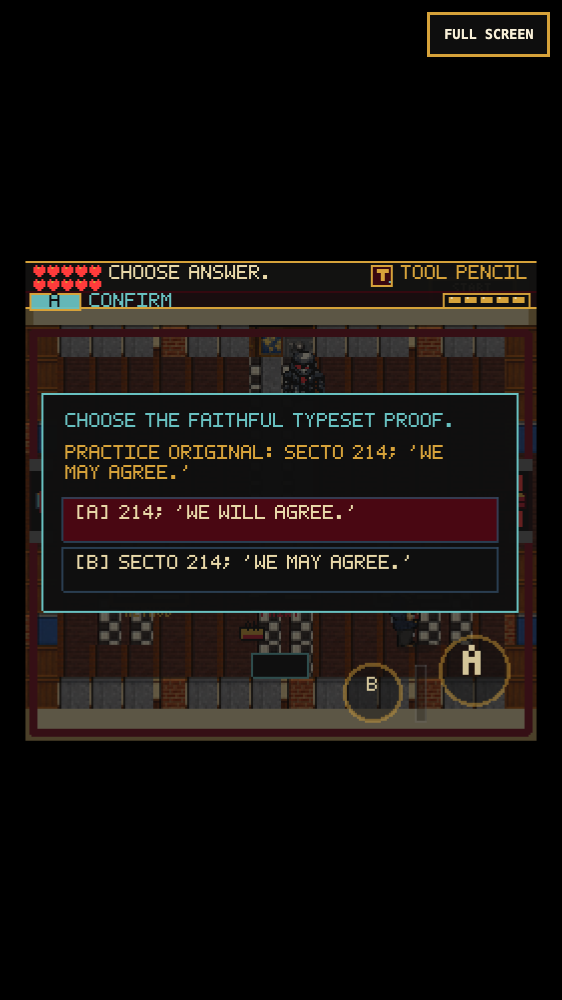
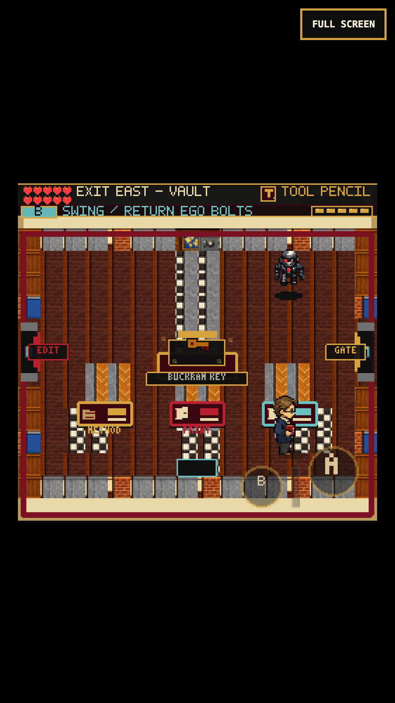

# Proof desks: inspect, correct, approve

## Observed problem

A production-browser replay reached the final three Silent Read desks and earned
their rewards by placing a file and pressing again. No evidence was presented.
Continue also reduced the visited-room list to the current room, and the finished
editor room incorrectly advertised a direct exit to the vault.

Baseline captures: `/private/tmp/frus-proof-baseline`.

## Play changes

- The traveling Review Folder and eight-file sequence remain. Only the opening
  editor packet and the proof-room packet need an outbox pickup.
- Placing a decision-bearing file at the correct desk immediately opens its check.
  Placement cannot answer the question or apply an approval stamp.
- The consultation desk asks the player to preserve a missing marginal note.
- The printing desk asks for a document-number index reference, not a page number.
- The proof table compares a telegram designator and wording against the original.
- Wrong choices leave the file on that desk with a short correction hint. They are
  rejected proposals, not committed editorial changes. No reward is granted.
- Correct choices show a short success toast; a separate press records human
  approval. The Buckram Key is awarded only after the last approved proof.
- Evidence and options use the same 8-pixel text size in these checks. Other
  ChoicePrompt callers retain their existing layout defaults.
- Continue retains visited proof rooms, including when backtracking to E1.
  Completed E1 now directs the player to the proof room, then S1 to the vault.

## Source and limits

[About the Series, FRUS 1989-1992, Volume XXXI](https://history.state.gov/historicaldocuments/frus1989-92v31/abouttheseries)
grounds the treatment of marginalia, document-number indexes, faithful
transcription, and telegram designators. The displayed margin, Berlin reference,
telegram number, and wording are explicitly labeled practice examples, not
quotations from historical documents.

Existing completion fields remain compatible with saves and later gates. They
represent bundled stage completion, not proof that a player answered every old
quiz. New `silentReadDecision_<file-id>` fields record actual successful decisions;
legacy saves keep earned progress without receiving fabricated new-check credit.
The scene's original 87 document-point reward total is unchanged.

## Verification route

1. Open `?scene=SilentReadScene&role=compiler&name=Sam&text=full`. This seeds earlier
   prerequisites; it is not a fresh full-game run.
2. Carry the editor draft to the desk, add the visible bracket, then stamp it.
3. Walk east, collect the proof packet, and file it at each indicated workstation.
4. Try the wrong choice at each production desk. Confirm no points, completion
   credit, or Buckram Key, then correct and separately stamp the file.
5. Continue from carried, routed, and verified files. Check position, carried label,
   visited rooms, and completed decisions. Backtrack and resume in E1 as well.
6. Finish the proof, confirm the open eastern gate, and walk into Black Vault.
7. Repeat with the floating D-pad and A/B controls at 375x667, DPR 3. Tap an answer
   row directly as an additional touch path. Inspect screenshots and console errors.

Unit coverage includes rejected and correct choices, placement/answer/stamp
separation, stale callbacks, key gating, save round-trips, invalid/finished route
steps, and complete untruncated evidence/option text within the screen.

## Results

- 143 Vitest files / 883 tests pass. TypeScript and production build pass.
- Final production build: 217 modules, main JavaScript 2,696.08 KB. The existing
  Vite large-chunk warning remains.
- Keyboard and 375x667/DPR-3 touch runs completed E1 -> S1 -> Black Vault with
  exactly 87 earned points, no duplicate rewards, and no page/console errors or
  horizontal overflow. They tested six Continue checkpoints, all three new wrong
  answers and corrections, the separate final stamp, backtracking, and direct
  answer-row tapping as well as A/B touch controls.
- Captures/readouts: `/private/tmp/frus-proof-final-qa`. Required-client captures
  were black (also on a headed retry); compositor screenshots were inspected.
- Browser metrics averaged about 60 fps with p99 20 ms, but included isolated
  50 ms desktop / 167 ms touch frames around the last transition. This is not
  locked-60 or real-iPhone/Safari certification, nor a full fresh-game replay.

