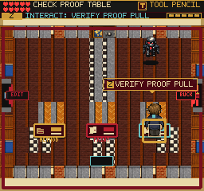
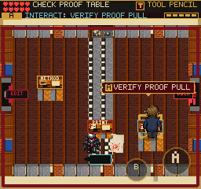
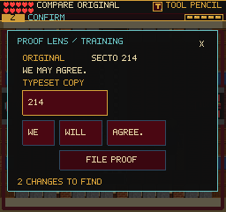

# Physical Editor and Proof Rooms

## Change

Editor and Silent Read workstations now occupy real 32x16 solids. Native
interior tile 16 supplies the desk surface; missing art retains a rectangle
fallback with identical collision. Desks sort at their front edge, routed
papers sit on the desk, and stamps no longer float across walking space.
The interaction banner remains above gameplay, but its target highlight is
below the compiler. Existing review choices, rewards and save schema remain.

Station centers in logical pixels:

| Phase | Stations |
| --- | --- |
| Editor | Editor (128,166) |
| Evidence | OpenNet (48,104), ClassNet (208,104), Referral (64,160), Proof (192,160) |
| Production | Consultation (64,104), Typeflow (128,160), Proof (192,160) |

Floor guidance follows clear authored aisles, not straight lines through
furniture. It does not move the player. Shared workstation geometry preserves
Referral's original helper API and aisle coordinates. DANN-E follows a
nine-waypoint loop outside furniture and walls; desks also block its bolts.

## Verification

- Final build: 247 modules; main JavaScript 2,781.22 KB, up 1.08 KB from
  the preceding commit. Existing Vite large-chunk warning remains.
- Final full suite: 184 files, 1,325 tests pass with
  `npm test -- --pool=threads --maxWorkers=2`.
- Eleven new geometry cases cover all three layouts, every integer position
  inside desks, clear routes and the complete enemy-body patrol.
- Keyboard and 375x667/DPR-3 touch chapter replays each reach Black Vault,
  earning the expected 87 points. They exercise mistakes, cancellation,
  partial edits, carried/routed/verified Continue, filing, rewards and
  backtracking. Each records 37 screenshots and 26 feedback-overlap checks.
  These complete runs precede the final highlight-depth-only adjustment.
- Final mobile furniture replay checks every production desk from both sides,
  actual collision, bolt blocking, all nine enemy waypoints with no solid
  overlaps, and unchanged document progress. Reliability falls from 100 to
  89 during extended ordinary enemy exposure; this is not a no-damage run.
- The legacy fixture changes only the position in an earned save to
  (192,167), a location observed inside the old desk during baseline play.
  It is not an untouched historical save: that movement had not autosaved.
  Recovery places the compiler at (192,172), without granting progress.
- The installed web-game client verifies walking into the desk and pressing
  action opens the proof comparison. Native/compositor captures are inspected;
  its direct WebGL-buffer screenshot is black and is not visual evidence.
- Final missing-interior-art replay passes the same production-desk, legacy
  recovery and nine-waypoint checks with no browser errors. The fallback
  remains playable, but retains older, busier room labels.
- Fourteen scene/pause/map smoke checks pass on the final build, including
  Referral after extracting its shared geometry. No browser errors reported.

Retained visual evidence:

Replay tools: `tools/qa-proof-comparison.mjs` and
`tools/qa-proof-furniture.mjs`. Supply an earned save through
`FRUS_QA_STORAGE`; furniture options include `--mobile`, `--legacy`, and
`--fallback`. Set `PLAYWRIGHT_MODULE` and `CHROMIUM_EXECUTABLE` when using
the installed browser runtime outside the repository.

Local artifacts: `/private/tmp/frus-proof-furniture-keyboard-aisles-0908`,
`/private/tmp/frus-proof-furniture-touch-0908`,
`/private/tmp/frus-proof-furniture-mobile-final-0908`, and
`/private/tmp/frus-proof-furniture-client-final-0908`.

## Remaining Work

The repeated eight-file review loop still needs a novice pacing pass. The
striped floor and older character art are not yet visually cohesive. Real
iPhone Safari, hardware performance, and complete fresh-game enjoyment are
not certified by simulated touch or these focused checks. This change is
local; no public deployment is implied.
