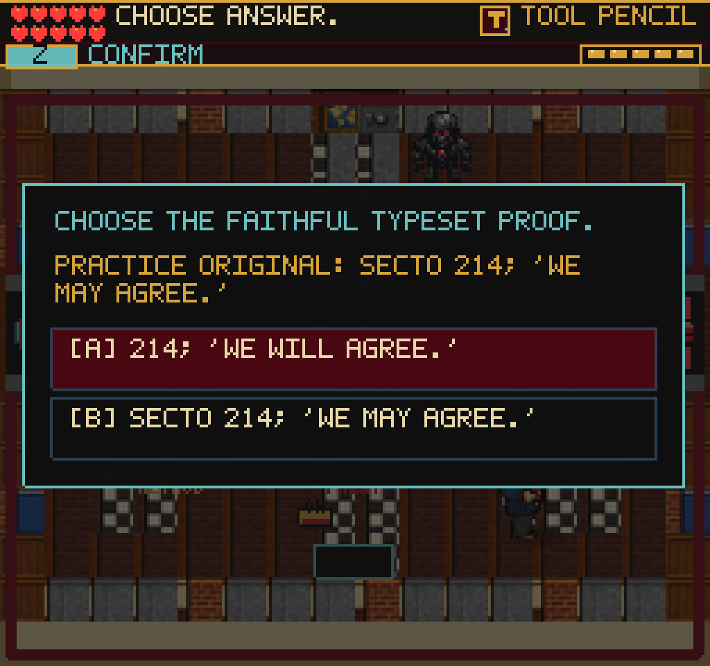
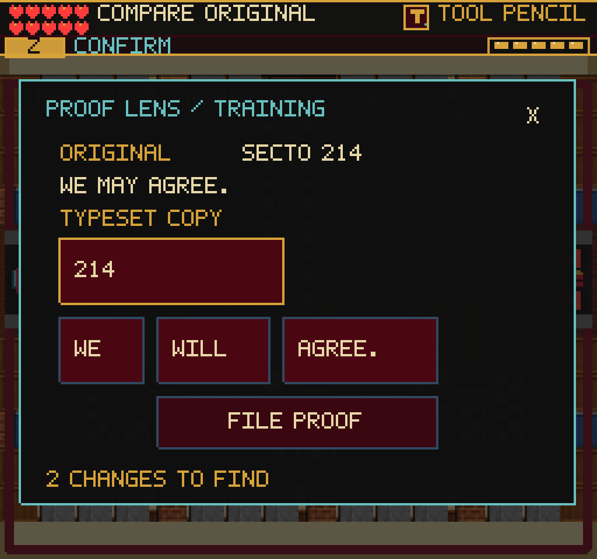
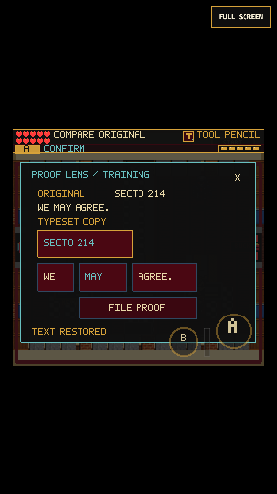

# Proof Lens comparison

## Earned-play finding

After the referral repair, a real saved run reached the editor, all proof desks
and the Black Vault. The route worked, but its last check was another two-answer
quiz. It is now a direct comparison with the training original.

The Proof Lens opens the original beside an editable typeset copy. The compiler
finds a missing telegram designator and an altered word. Tapping a changed token
restores it; keyboard and controller navigation select the same tokens. Correct
words remain unchanged. The player can fix either discrepancy first.

Two repairs are required. File rejects an incomplete proof without damage or
credit. Correcting both does not file it automatically. Filing verifies it; the
existing separate human stamp earns the same reward and Buckram Key.

This practices fidelity to source wording and telegram designators from
[About the Series](https://history.state.gov/historicaldocuments/frus1989-92v31/abouttheseries).
The short telegram is fictional training text, not a quotation from an actual
historical record. This is correction of a typesetting error, not alteration of
the archival original. It makes no new declassification decision.

## Implementation

- `src/game/proofComparison.ts`: original/draft tokens, two repair bits,
  idempotent edits, validation and the official source URL.
- `src/systems/proofComparisonBoard.ts`: native 8px text, editable tokens,
  remaining-error feedback, separate File and close. Corrected text and the
  count distinguish progress without relying solely on color.
- `SilentReadScene`: requires ownership of the earned Proof Lens, opens the
  comparison on placement, freezes player/weapon/DANN-E while open, and retains
  existing workflow transitions and reward amounts. A stale callback cannot
  verify another file or pay twice. The older final multiple-choice data is
  removed; earlier chapter decisions are unchanged.
- `sceneProgress.silentReadProofRepairs`: optional integer 0-3 in the existing
  save system. Both partial states and complete-but-unfiled state survive reload.
  Invalid codes reset this comparison only. Existing verified/completed saves
  keep their progress; no schema change.
- HUD objective localized in English, Spanish and French. The original and
  comparison remain English, consistent with the current training record.

## Verification

- 169 test files / 1,123 tests pass. Covers both edit orders, unchanged/repeat
  taps, missing lens, malformed saves, all four states through the actual save
  boundary, explicit filing, separate stamping, stale callback and paused input.
- TypeScript and production build pass: 231 modules; main JS 2,728.57 KB,
  +4.51 KB from `7ac3e65`. Only the existing large-chunk warning. No dependency
  or source-art additions.
- Real-clock keyboard and 375x667/DPR-3 CDP touch continue earned Referral exit
  saves through Editor E1, all eight files, two repairs, partial reload,
  verification, final stamp, Buckram Key, backtracking and Black Vault entry.
  Both earn exactly 87 points (114 -> 201), with no duplicate reward and no
  page/console errors. No completion flags are granted by the replay.
- Separate final panel checks verify the opposite repair order, repeat taps,
  persistent rejection feedback, X close, desktop Codex return, reload and no
  closing-input swing. Player, weapon, reliability and threats remain frozen
  during comparison. A label touching a field was found visually and fixed.
- Fourteen scene/pause-map smoke routes pass. The required web-game client also
  repairs both tokens. Its direct WebGL-buffer captures remain black headed and
  headless; renderer-native and compositor screenshots were opened and inspected.

Replay: `tools/qa-proof-comparison.mjs`. Set `FRUS_QA_STORAGE` to an earned
Editor entry from `tools/qa-referral-manifest.mjs`; add `--mobile` for touch.
Optional `PLAYWRIGHT_MODULE`, `CHROMIUM_EXECUTABLE`, `FRUS_QA_URL` and
`FRUS_QA_OUT` select the existing runtime, build and output directory.

## Remaining work

This is a local chapter improvement, not proof that the whole game is finished
or fun enough. No deployment, new full-game completion, real iPhone Safari test
or locked-60 certification is claimed. Earlier proof desks still repeat similar
checks; reward banners, older mixed sprite art, and source-note metadata remain
follow-ups. The earned saves now reach DANN-E for the next combat/pacing pass.
