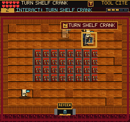
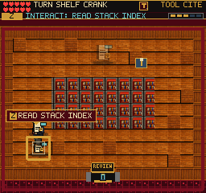

# Referral Discovery Audit

September 9, 2026. Local preview; no deployment implied.

## Playthrough

The earned Network save was played through Referral in a simulated 375x667
touch viewport. All 38 checkpoints completed through the editor handoff;
`errors.json` is empty. The route exercised incorrect filing, partial drafts,
cancellation, Continue, recovery of the original dispatch copy, the shelf-crank
shortcut, human concurrence, treatment choices, and the Concurrence Slip reward.
Evidence: `/private/tmp/frus-referral-discovery-0909/mobile-375x667-dpr3/`.

This guided run establishes operability, not unaided comprehension or fun.
The original-copy detour and physical return shortcut are the clearest
adventure beats. The length of the filing sequence remains a playtesting concern.

## Corrected Affordance

The generic document prompt prefixed already-authored action labels, producing
`CHECK READ STACK INDEX` and similar wording. Dispatch targets now show their
own READ, TAKE, or TURN label directly. No save, rewards, collision, or task rules
changed.

The updated browser regression asserts READ DISPATCH COPY, TURN SHELF CRANK,
and READ STACK INDEX in both packed-art and missing-packed-art cases. It walks
the side aisle without opening the crank, returns to review, reenters the stacks,
checks the closed shelves still collide, and verifies inventory, points and
document candidates did not change. Both cases passed without page errors.
Evidence: `/private/tmp/frus-dispatch-prompts-after-0909/`.

## Verification

- Build passes: 255 modules; main JS 2,802.61 KB. Existing large-chunk warning.
- All 195 test files / 1,456 tests pass.
- The unit assertion is a structural guard; browser assertions prove visible text.
- Native normal-art and fallback screenshots inspected.
- Installed keyboard client resumed and walked in R3. Its after capture stopped
  outside the index interaction radius, so it is movement evidence only; the
  dispatch regression supplies the visible prompt proof.
- No physical-iPhone performance or whole-game completion claim.

Next: audit the earned editor handoff, then assess the entire chapter with an
unaided player before treating repeated filing as an enjoyable challenge.
