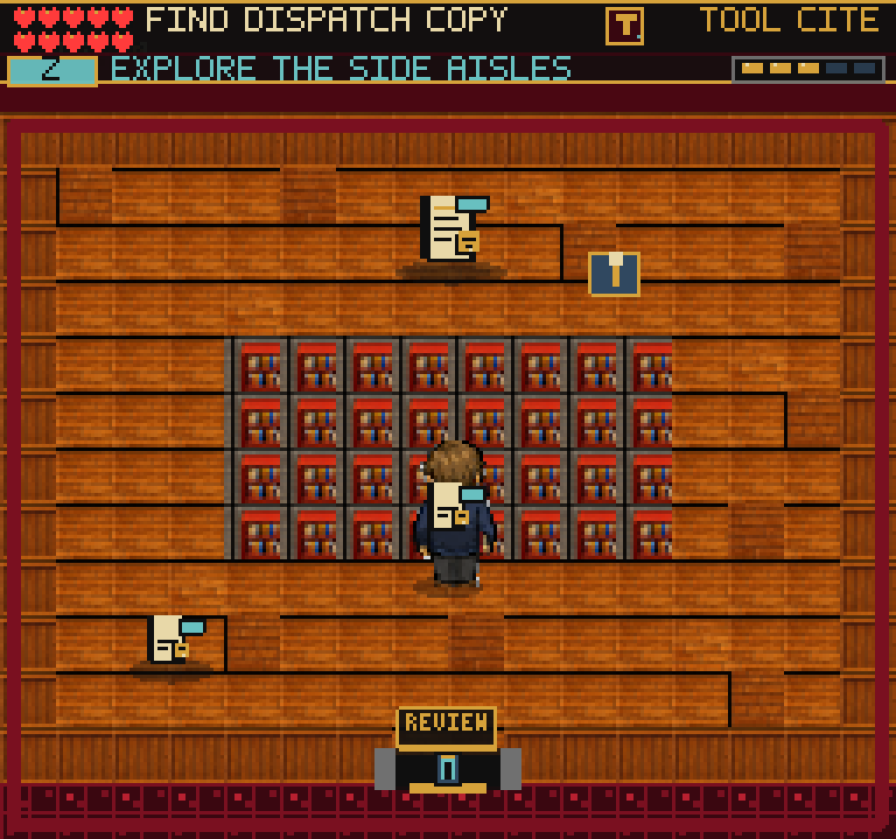
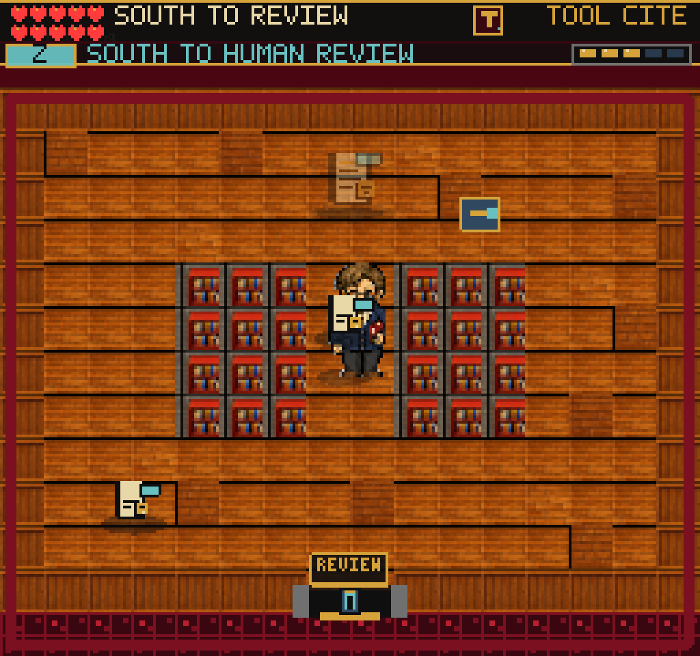
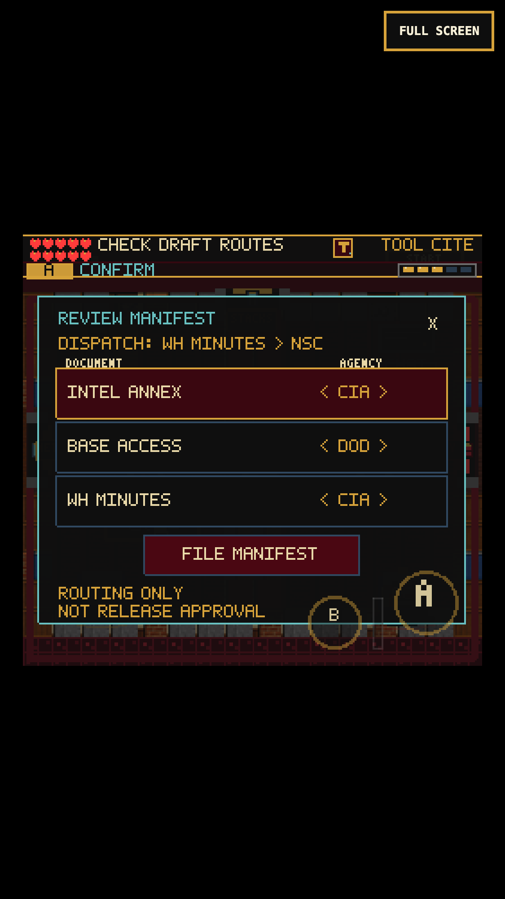
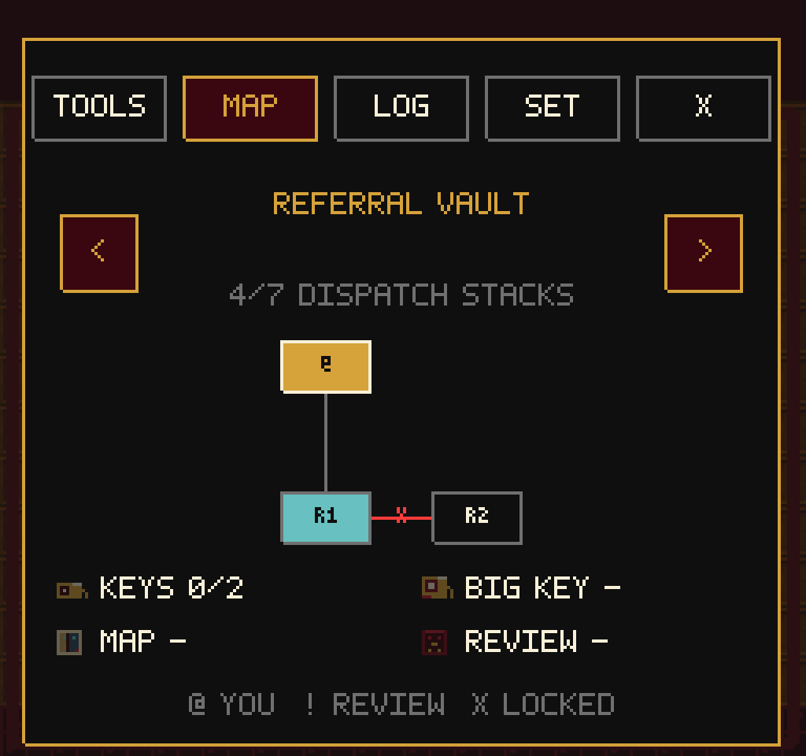

# Dispatch Stacks Evidence Trip

## Gameplay

Referral Vault now has a third, separate screen: Dispatch Stacks. Its north
entrance from the Equity Gate uses the Clearance Token earned in Two Networks.
The room separates physical exploration from the existing human-review desk.

Two three-tile side aisles lead around a central shelf bank to a training
dispatch copy. The copy records that the White House Minutes route to NSC.
A crank on the far side opens a two-tile center aisle for a shorter return.
Either side aisle remains usable without the crank. DANN-E does not attack in
this reading room; pressure resumes in the existing referral rooms.

An unreviewed StateChat manifest cannot be filed without its source copy.
The recovered evidence appears alongside the draft, but does not change it:
the player must compare the route, correct the error, and explicitly file the
manifest. Cancel and Continue retain unfiled edits. Finding evidence has no
reliability penalty or reward and is not release authorization. All existing
foreign-government permission, appeal, and visible-excision decisions remain.
This is fictional training material, not a transcription of an official record.

## Implementation

- `referralDispatch.ts` owns room geometry, interactable positions, evidence,
  objectives, and two existing-schema `sceneProgress` flags:
  `referralDispatchCopyFound` and `referralDispatchAisleOpen`.
- `ReferralVaultScene` implements R1/R3 travel, real tile collision, pickup,
  crank, review gating, and room restoration. Equity files, manifests, and
  treatment dockets keep their carried icons and state through both doors.
- `FRUS_ROOM_GRAPH` and the pause map include R3. Only the north R1 door
  requires the Clearance Token; the return cannot lock behind the player.
- Existing completed manifests are not reopened and old saves are not assigned
  discoveries they never made. No save-version, inventory, document, process
  stamp, point-reward, or release-rule changes.
- The HUD uses short objectives and an exploration cue instead of the combat
  cue in R3. New HUD cues have English, Spanish, and French strings.

### Art / Collision

No new assets or dependencies. The existing packed native interior tileset,
`pack-tiles-interiors-native`, is used at 16 pixels, 8 columns, zero spacing.
Zero-based source indices: wood fills 32/40/56/57, shelf 19, border panel 8.
The map's GID conversion adds one; empty cells remain -1. Floor variations are
sparse rather than alternating high-contrast squares. Wall cells and collision
rectangles come from the same definition. Opening the crank removes exactly
the central two shelf columns from both.

If the packed texture is missing, the room uses the same collision geometry
with simple visible solids. Generic furniture and the large fallback compass
are deliberately not added to R3. Existing R1/R2 fallback paths remain intact.

## Verification

- Full unit suite: 178 files / 1,228 tests. Production build passes:
  239 modules, main JavaScript 2,761.96 KB; existing Vite chunk warning only.
- Six focused tests cover tool-gated entry, unconditional return, floor and
  collision agreement, generous side aisles, two-tile shortcut, no interaction
  through shelves, save round-trip without rewards/approval, old-save discovery
  defaults, and objective/evidence width at native bitmap size.
- `tools/qa-referral-manifest.mjs` starts from an earned Network completion,
  walks the complete referral chapter, and reaches the Editor. It checks early
  and late carried batches in R3, Continue, missing-copy rejection, both source
  and crank, the pause map, no input fall-through, incorrect-draft rejection,
  canceled/continued edits, all treatment decisions, and the Concurrence Slip.
  `--mobile` uses real touch events at 375x667 / DPR 3 and takes the other aisle.
  Named storage snapshots preserve earned entry, recovered copy, and open aisle.
- `tools/qa-referral-dispatch-safety.mjs` starts from the earned recovered-copy
  snapshot. It returns without turning the crank and re-enters to verify the
  shelves still block the direct route. A blocked native-image request repeats
  this with actual fallback rendering. Optional `FRUS_QA_LEGACY_STORAGE` uses
  an old completed Editor save, backtracks through Referral, and confirms that
  no re-filing, reward, inventory change, or document change is introduced.
- The required game client opens the crank and walks through the gap using
  earned state. Its direct WebGL-buffer images are black in both headless and
  headed Chromium; actual native-renderer and compositor captures were inspected.
- Scene-debug / pause-map regression covers Title, CharacterCreate, Office,
  Guide, Archive, Network, Referral, SilentRead, Garden, Black Vault, Senate,
  NARA Stacks, Hidden Reading Room, and Embassy.

For either maintained replay, set `FRUS_QA_URL`, `FRUS_QA_OUT`,
`FRUS_QA_STORAGE`, and, if necessary, `PLAYWRIGHT_MODULE` /
`CHROMIUM_EXECUTABLE`. Run against a stable build: replacing `dist` during a
Continue reload can remove the hashed JavaScript requested by that browser.
An interrupted mobile run exposed this QA setup issue; it is not counted as a
pass. Missing-asset QA deliberately generates a failed network request.

Local evidence includes `/private/tmp/frus-dispatch-carried-desktop`,
`/private/tmp/frus-dispatch-stable-touch`,
`/private/tmp/frus-dispatch-safety-final`,
`/private/tmp/frus-dispatch-required-release`, and
`/private/tmp/frus-dispatch-release-scene-smoke`.

## Remaining Work

The broad adventure/fun goal is not complete. This adds an original evidence
discovery and return loop, not a claim that desk-heavy chapters or uneven art
are solved. Next: play the expanded critical path without checkpoint breaks,
evaluate how often a first-time player needs instructions, and tune pacing and
encounter variety. Real iPhone Safari remains unverified. Local preview only;
no public deployment is part of this change.
