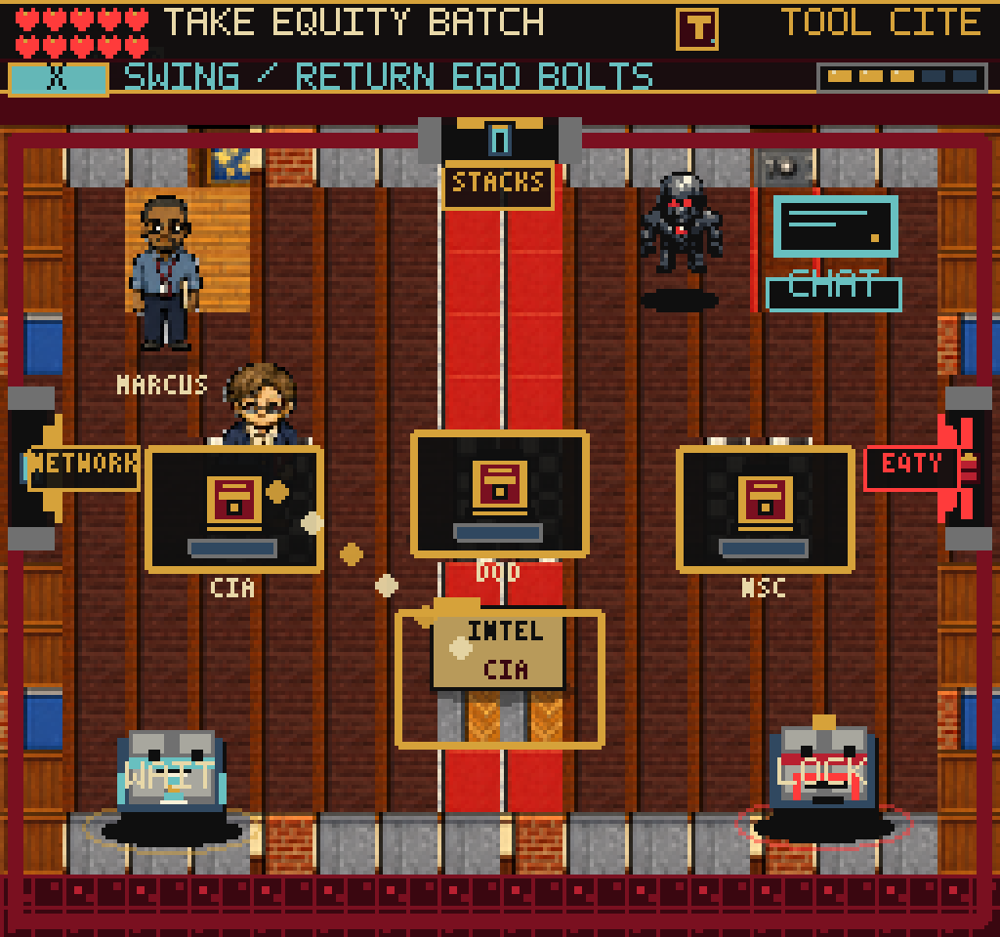
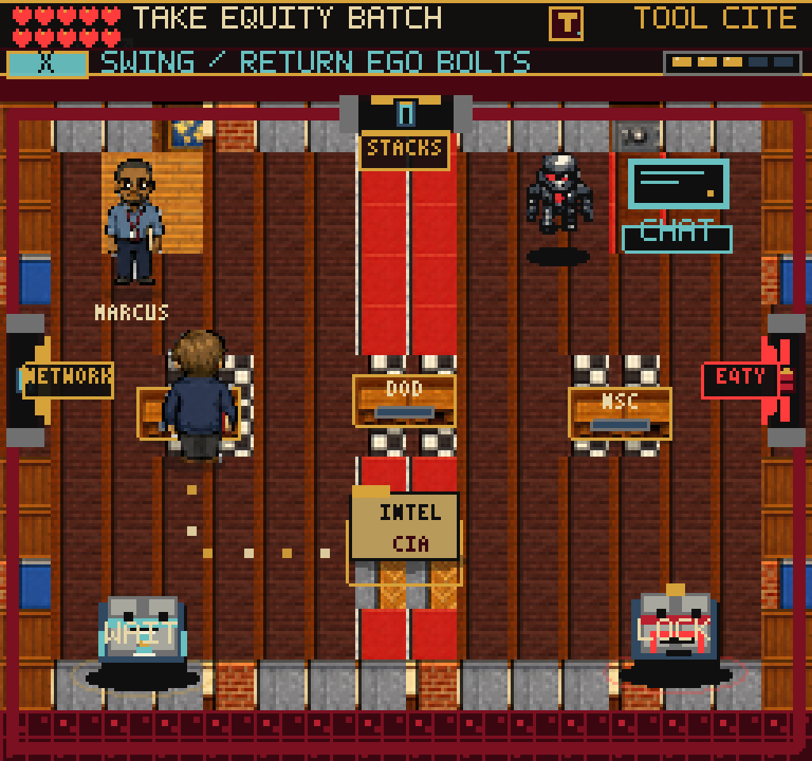
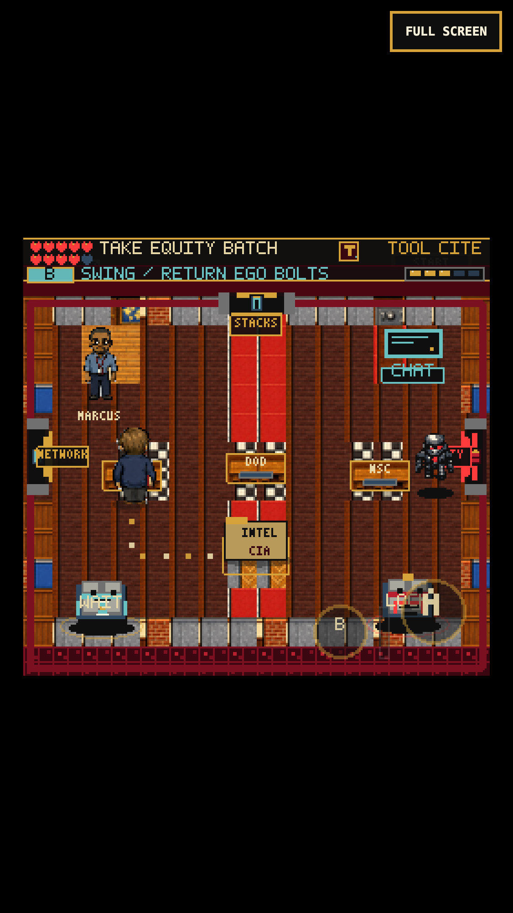

# Physical Referral Workstations

## Reproduced Problem

The old Referral R1 stations were large floating panels at fixed depth 150,
without furniture collision. Actual keyboard movement placed the compiler
inside the CIA station at (61, 130). An older required-client capture at
(53, 150) hid the character completely. A pagehide save from that real
pre-change playthrough supplies the legacy-position regression fixture.

## Changes

- Agency, human-concurrence and treatment desks share a 32x16 solid footprint.
  The three agency desks leave 36-pixel gaps, more than two floor tiles.
  Positions, interaction radii, packet requirements and rewards are unchanged.
- Two native 16x16 desk tiles replace each oversized panel. The existing packed
  interior sheet supplies zero-based tile 16 (column 0, row 2; eight columns).
  Named frame `referral-desk` uses the existing `pack-tiles-interiors-native`
  texture. Missing art gets a rectangle with identical furniture collision.
- Desk depth follows its front edge. The compiler draws in front when
  approaching from below, and behind the furniture on the far side.
  R1 action prompts stay above the character frame; target highlights remain
  on the actual station. Guide dots are smaller, drawn on the floor, and
  follow clear aisles instead of pointing through furniture.
- An old save or a changing review layout only adjusts the player if the
  existing position is blocked. The nearest clear position is selected using
  the same inclusive 16x8 foot geometry as Player. Valid positions are left
  untouched. No save fields, document edits, auto-filing or rewards are added.
- DANN-E follows the surrounding aisles and Ego bolts stop at solids. The
  northern waypoint also clears the existing wall. Combat timing, damage,
  active tool counters, quiet stacks and room progression remain unchanged.

`referralWalkRoute` is a small, room-specific floor-cue calculation using
authored aisle lines. It does not move the player or add global pathfinding.
Browser replay tools use it to choose real directional input around the
furniture; they do not teleport or grant progression.

## Verification

- Full suite: 183 files / 1,307 tests pass, including twelve new furniture
  cases. Tests cover all three layouts, every integer desk-interior save
  position, normal-position preservation, desk/exit connectivity, blocked
  destinations and DANN-E's complete 18x20 patrol body.
- Production build passes: 245 modules, main JS 2,777.94 KB, an increase of
  2.37 KB from the prior contact-fairness commit. Existing chunk warning only.
- Keyboard and 375x667/DPR-3 simulated touch physically stop at all three
  agency desks and file CIA successfully. Walking around to the far side
  checks depth ordering. The older save moves from (61, 130) to (61, 142).
  Missing-native-texture replay also passes collision, filing and recovery.
- Collision assertions read actual subpixel feet. Snapped rendered feet may
  touch the border but must not penetrate it. An earlier QA assertion
  incorrectly treated that harmless rendered-edge contact as physical overlap;
  no global player collision behavior was changed to satisfy the test.
- Complete keyboard and 375x667/DPR-3 touch chapter replays reach the Editor
  with 114 points, 100 reliability, the Concurrence Slip and no standards
  findings. Both cover wrong desks, carried-state Continue, physical stacks,
  the shelf shortcut, editable human review, cancellation, filing, the reward
  room and backtracking without duplicate rewards. Final touch screenshots
  also verify higher-contrast review-desk labels.
- Final touch and fallback observers see all six DANN-E patrol waypoints with
  no furniture/wall overlap. The touch combat regression records zero phantom
  hits, two real contacts, 111 close non-contact frames and a successful
  Citation Stamp counter using simultaneous D-pad/B input.
- Fourteen scene routes render nonblank and pass pause/map return checks.
  No page or console errors. The required skill client physically walks into
  the CIA desk and swings; its compositor capture shows the compiler visible.
- An unrestricted final test rerun encountered three fork-worker startup
  timeouts, not failed assertions. The unchanged final source passes all
  1,307 tests with `npm test -- --pool=threads --maxWorkers=2` in 9.50 seconds.
  Earlier unrestricted full-suite runs also passed. No test assertions or
  global test settings were weakened.

## Replay

Provide an earned Referral-entry storage file with `FRUS_QA_STORAGE`, the
installed `PLAYWRIGHT_MODULE` and `CHROMIUM_EXECUTABLE`, and optional
`FRUS_QA_URL` / `FRUS_QA_OUT`.

```sh
node tools/qa-referral-furniture.mjs --baseline # Old build: save inside CIA
node tools/qa-referral-furniture.mjs            # New build: restore and walk
node tools/qa-referral-furniture.mjs --mobile
node tools/qa-referral-furniture.mjs --fallback
node tools/qa-referral-manifest.mjs
node tools/qa-referral-manifest.mjs --mobile
node tools/qa-danne-contact.mjs --mobile
```

Final evidence directories under `/private/tmp/`: `frus-furniture-baseline-0908`,
`frus-referral-furniture-keyboard-final-0908`,
`frus-referral-furniture-touch-final-0908`,
`frus-furniture-patrol-touch-final-0908`,
`frus-furniture-patrol-fallback-final-0908`,
`frus-furniture-contact-final-0908`, `frus-furniture-client-final-0908` and
`frus-furniture-scenes-final-0908`.





This is local Chromium verification, not public deployment, real-iPhone Safari
certification or completion of the broader adventure goal. The crowded Editor
arrival card and full-route novice pacing remain separate follow-ups.
