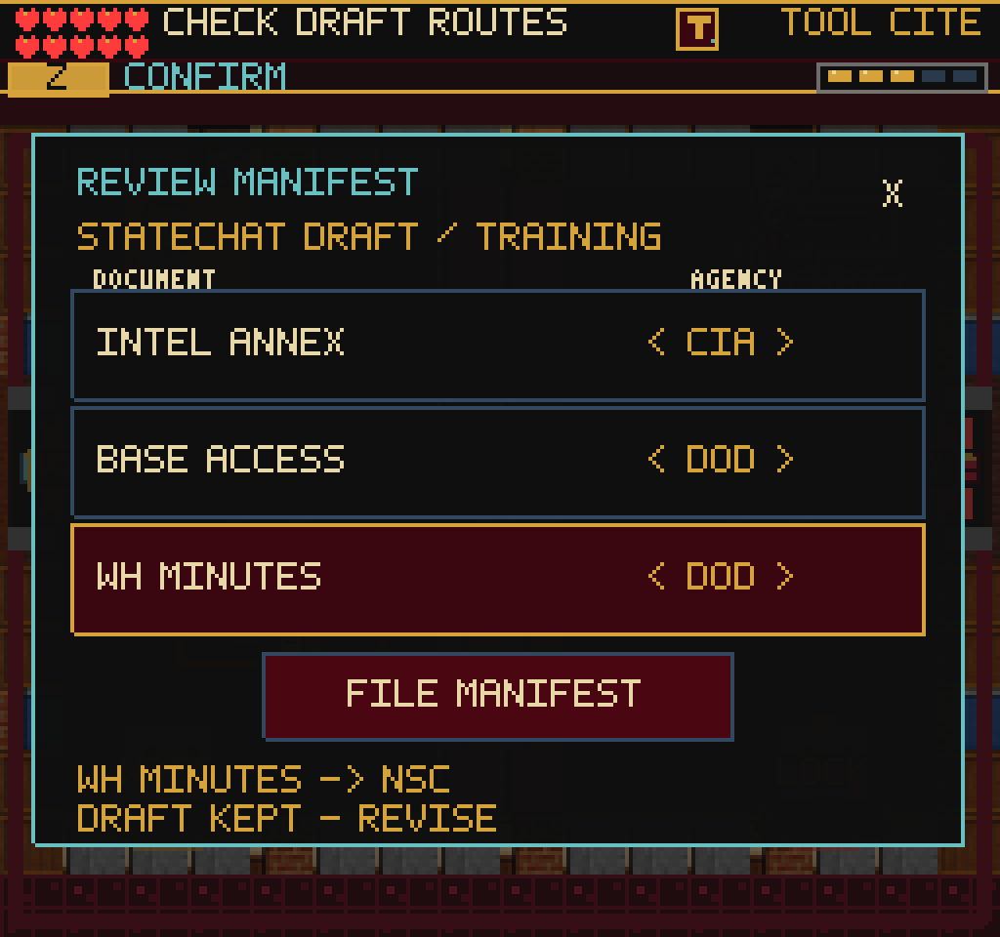
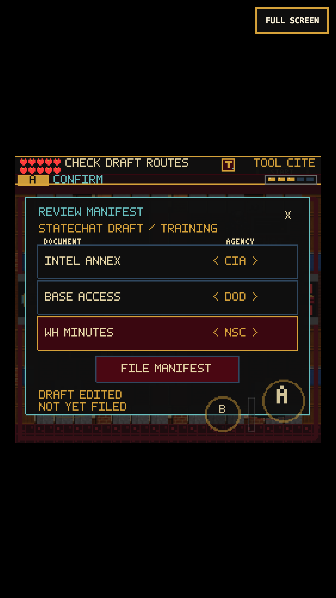

# Referral manifest repair

## Playable change

The earned Referral Vault baseline accepted StateChat's manifest just by placing
it at the human desk. The compiler now edits three document destinations and
explicitly files the corrected draft. The training draft contains one wrong
route. This is a short repair task, not another multiple-choice quiz.

- Row bodies select; the two arrow areas edit in either direction. Keyboard
  navigation and touch A/B also work. File is a separate action.
- Incorrect filing gives a short, document-specific hint without damage or
  rewards. A correction alone does not approve the manifest.
- Cancel, close, Codex, and reload retain the unfinished draft. Reading freezes
  the player, weapon and DANN-E; dismissing cannot add an attack.
- Successful filing awards the existing eight document points and seven
  reliability once. Existing treatment, stamp, Concurrence Slip and exits stay
  intact. The human desk's short REVIEW label fits its plate.

## Historical boundary

Source: [About the Series, FRUS 1989-1992, Volume XXXI](https://history.state.gov/historicaldocuments/frus1989-92v31/abouttheseries).
The page describes concurrence by concerned agencies and visible accounting for
withheld material. The game distinguishes routing from release approval.
These three fictional training records and their single destinations are not
rules for real records; actual documents can involve multiple equities.

## State and implementation

`src/game/referralManifest.ts` owns the typed routes, validation and base-three
encoding. `sceneProgress.referralManifestDraftRoutes` uses the existing numeric
save field convention (1-27; absent/invalid starts an unapproved draft). It
preserves all 27 edited combinations rather than correcting on load. Existing
completed-manifest saves remain completed. No save schema migration, new
dependency, art, reward changes or room-graph changes.

`ReferralManifestBoard` uses existing input, pixel text, pause/choice and audio
helpers. The HUD's short review objective is available in English, Spanish and
French; the board itself is still English.

## Verification

- 168 Vitest files / 1,108 tests pass, including all draft states, both edit
  directions, invalid-save recovery, text bounds and the guarded scene wiring.
- Production build passes: 229 modules, main JS 2,724.06 KB (+5.12 KB over
  `53fc25d`); only the existing large-chunk warning.
- Real-clock desktop and 375x667/DPR-3 touch continue an earned Network exit
  through all Referral handoffs, bad draft, partial edit/reload, corrected
  filing, treatment, Concurrence Slip, backtracking and physical Editor entry.
  Replays contain no page/console errors. No granted completion flags.
- Final panel checks cover pointer row selection, left/right editing, wrong
  filing, X cancel/reopen, one-time reward and desktop Codex return. Native and
  compositor screenshots were opened and inspected at the final 8px status size.
- Fourteen scene/pause-map routes pass. Required web-game client also edits the
  draft. Its direct WebGL-buffer image remains black in headed/headless capture;
  inspected renderer-native/compositor images are the visual evidence.

Replay: `tools/qa-referral-manifest.mjs`, with `FRUS_QA_STORAGE` set to an earned
Referral entry from `tools/qa-network-ledger.mjs`. `--mobile` uses actual CDP
touches. `PLAYWRIGHT_MODULE`, `CHROMIUM_EXECUTABLE`, `FRUS_QA_URL` and
`FRUS_QA_OUT` optionally select the existing runtime and output location.

Local checkpoint only, not a deployment, new full-game completion, real-iPhone
test or frame-rate certification. Next: earned Editor play, repeated desk-check
pacing, older floating reward banners and richer source-note metadata.
