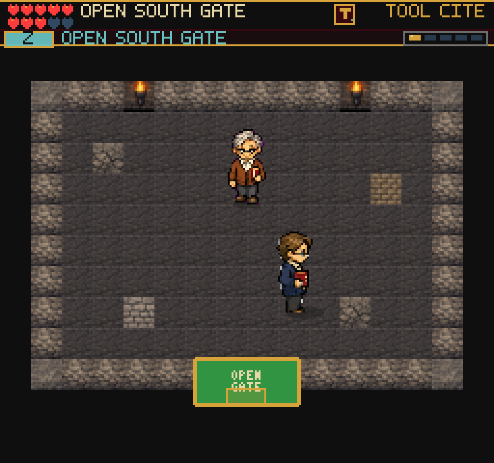

# Grounded Archive Guide

The Guide's archivist now uses the same shaded, original pixel-art family as
the compiler. Silver hair, glasses, rust cardigan and a ruby volume distinguish
the colleague without a permanent name label. The guide now stands still over
a small shadow instead of bobbing like a floating pickup.

## Audit and Import

The old runtime `sprites/native/sprite_archivist.png` was a flat placeholder.
The larger `sprites/sprite_archivist.png` is not a drop-in replacement: visual
inspection shows five rows and a painted backdrop, despite the manifest's
four-row, transparent-sheet declaration. Both originals remain untouched.

The replacement was generated on 2026-09-09 with the built-in image tool and
the existing compiler as the reference. The brief requested an older human
archivist with silver hair, glasses, rust cardigan, ivory shirt, dark trousers,
and a ruby archival volume; dark outlines, three-tone shading, no text, no
scenery, no shadows, and a pure magenta extraction background. Fifteen poses
follow the existing idle/walk/interact/read/approval order; cell 15 is blank.

Source: `assets/character-sources/archivist.png` (1024x1536).
Export: `public/assets/art-pack/sprites/refreshed/sprite_archivist.png`
(128x192, 32x48 cells). The existing importer uses inspected row boundaries
0/390/770/1130/1536, removes magenta, and samples nearest pixels at one shared
scale. Source art stays outside the public build. Attribution is recorded in
`assets/LICENSES.md`; this is original AI-assisted project art, not a claim of
a third-party CC license.

The `archivist` texture key and `archive-colleague` NPC mapping are unchanged.
No save fields, interaction ranges, rewards, dialogue, or collision rules changed.

## Verification

- Build passes: 255 modules; main JS 2,802.52 KB. Existing chunk-size warning.
- Full suite: 195 files, 1,453 tests pass. Native frame tests verify complete
  poses, binary alpha, absent chroma background, consistent feet and empty cell 15.
- Fresh simulated-touch opening at 375x667 passes counter practice, harmless
  miss, pause, tool-versus-interact pickup, no duplicate reward, Continue and
  Archive entry. Browser error list is empty.
- Required installed browser client also resumed an existing earned Guide save.
  Native and compositor screenshots inspected with both hero and guide visible.
- Evidence: `/private/tmp/frus-archivist-touch-0909/` and
  `/private/tmp/frus-archivist-client-0909/`; retained image below.

This verifies a character-art improvement, not the entire game's enjoyment or
physical-device performance. Archive discovery and unaided comprehension remain
important next playtest targets. Not deployed.
